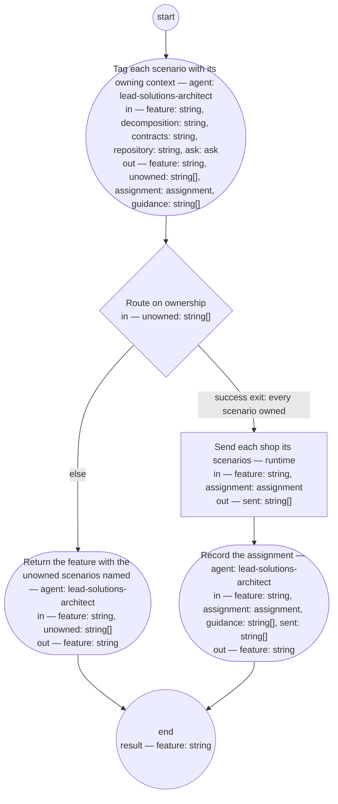

# Process: Scenario assignment

**Purpose:** Turn a checked feature into work the Bounded Context shops
can take up: the solutions architect role tags each scenario with the
context that owns its behavior, reads each tagged context's
pre-state, sweeps the feature repository for conflicts, records the
feature as assigned, and sends each shop its scenarios as an
`assign_scenarios` message.

**Guiding statement:** The decomposition decides, not the wording.
Which context owns a behavior is read from the decomposition and the
contexts' contracts; a scenario no context can own is the architect's
finding, not a guess.

**Outcomes:**
- O1. Every scenario in the feature carries exactly one
  `@bounded-context:` tag (judged in `assign`), or the feature is
  returned with the scenarios no context owns named — witnessed by
  `assign`'s outputs and `route`.
- O2. Each tagged context's pre-state — its contracts and the feature
  repository, declared inputs of `assign` — is read and carried in
  `assignment`; `dispatch` sends one `assign_scenarios` message per
  entry — witnessed by `dispatch`'s `run`, which iterates
  `entries[].context`.
- O3. The feature's status becomes `assigned` and the assignment —
  the pre-states read and the messages sent — is recorded in its
  Document History —
  judged in `record` from `assignment` and `sent`.
- O4. A question the decomposition cannot answer — whether a behavior
  is in scope at all — leaves the run as an ask to the PM role with a
  default — witnessed by `assign`'s `asks` and the `ask` value.

**Roles:** assigner —
[`../roles/lead-solutions-architect.md`](../roles/lead-solutions-architect.md)
(decides which context owns each scenario — its decomposition
decision right — and sweeps the feature repository for conflicts —
its assignment-loop accountability, under its posture that the
pre-state, not the wording, decides). The [PM role](../roles/lead-pm.md) — answers asks.
Bounded Context shops — receive their scenarios; not a role of this
process.

**Carried by:**
[`../../.claude/skills/scenario-assignment/SKILL.md`](../../.claude/skills/scenario-assignment/SKILL.md)
— generated from this definition by
[`../tools/compile_process.py`](../tools/compile_process.py), never
edited by hand.

## Flow (compiled)

Generated from the steps below by `tools/compile_process.py`; do not
edit by hand.




## Data

Each entry names a process-local value. Simple types use JSON Schema
names inline; every structured shape is a `$ref` to a defined type with
an explicit source. Conditions are CEL expressions over these names.
`decomposition` is the path of the solutions architect's structural
model, and `contracts` the path under which each Bounded Context's contracts
are read, and `repository` the path of the lead shop's feature
repository — the directory of feature artifacts themselves (typedef:
[`../artifacts/feature.md`](../artifacts/feature.md)); neither of the
first two has a typedef on this branch — an unfiled gap, named here —
so each names the record the architect maintains, an approved source
by the role's own admissible evidence. `guidance` is the paths of the
implementation guidance records the `assign` step writes — one per
Bounded Context tagged, at `guidance/<feature>-<context>.md`, the
feature's id and the context's name as tagged (typedef:
[`../artifacts/implementation-guidance.md`](../artifacts/implementation-guidance.md));
the `record` step names them.

```yaml
data:
  feature: {type: string, format: uri-reference}
  decomposition: {type: string, format: uri-reference}
  contracts: {type: string, format: uri-reference}
  repository: {type: string, format: uri-reference}
  ask: {$ref: ask, from: ../types/ask.md, initial: null}
  unowned: {type: array, items: {type: string}, initial: []}
  assignment: {$ref: assignment, from: ../types/assignment.md}
  guidance: {type: array, items: {type: string, format: uri-reference}, initial: []}
  sent: {type: array, items: {type: string}, initial: []}
```

## Steps

```yaml
start: assign
parameters: [feature, decomposition, contracts, repository]
result: feature
steps:
  - id: assign
    name: Tag each scenario with its owning context
    run-by: {role: lead-solutions-architect, execution: agent}
    inputs: [feature, decomposition, contracts, repository, ask]
    outputs: [feature, unowned, assignment, guidance]
    asks: [lead-pm]
    prompt: |
      Read the decomposition and the feature. For each scenario, decide
      which Bounded Context owns the behavior it states — from the
      decomposition and that context's contract at contracts, never
      from the scenario's wording alone — and write a single
      @bounded-context:<name> tag on it. A scenario whose behavior no
      context owns, that two contexts would each have to own, or whose
      owning context differs from the shop Contributors names as its
      owner, goes to unowned with the reason; do not guess. Then, for each context
      tagged, read its pre-state — the state of the design: its contract
      at contracts and the feature repository at repository — and
      sweep the repository for conflicts: a scenario that contradicts
      one already specified there goes to unowned with the conflict
      as its reason. Write one assignment entry per context with
      the @hash: values of its scenarios and the pre-state read. When no
      scenario is unowned, write for each context tagged one
      implementation guidance record at guidance/<feature>-<context>.md
      — the feature's id and the context's name as tagged — by its
      guideline: what its scenarios change at the level you may see
      (its contract, the guardrails that apply, where the cross-context
      flow touches it; for the lead shop's own definitions, the
      definitions and tools to change), the references to the contract
      and the scenario hashes, and what not to do; evaluate it against
      its fitness set before you write it; it is a historical record of
      this assignment and is not sent. Put each record's path in
      guidance. If deciding needs what the decomposition
      cannot say — whether a behavior is meant to be in the product at
      all — return an ask to lead-pm (kind: scope) with the question,
      the default you will apply, and a checkpoint of the tags written
      so far; on the first pass ask is absent, and if it carries an
      answer or resolved defaulted, act on it. Return the tagged
      feature.
    next: route

  - id: route
    name: Route on ownership
    run-by: {execution: runtime}
    inputs: [unowned]
    branches:
      - label: "success exit: every scenario owned"
        when: size(unowned) == 0
        next: dispatch
      - else: return

  - id: return
    name: Return the feature with the unowned scenarios named
    run-by: {role: lead-solutions-architect, execution: agent}
    inputs: [feature, unowned]
    outputs: [feature]
    prompt: |
      Write a review entry into the feature's Document History naming
      each unowned scenario and its reason and set the feature's
      status to "returned" — the returned feature is the handoff to
      the PO role, which reads its status. The decomposition may need
      a change, which this role raises as an architecture decision
      record; the scenario may need a split, which is the PO role's;
      or the feature's Contributors must be corrected to name the
      owning shop the decomposition places the behavior in, which is
      the PO role's; or the scenario contradicts one already specified
      in the feature repository, which the PO role resolves against
      the framing — the reason in unowned names which case.
    next: end

  - id: dispatch
    name: Send each shop its scenarios
    run-by: {execution: runtime}
    inputs: [feature, assignment]
    outputs: [sent]
    run: |
      for ctx in ${assignment.entries[].context}; do
        shop-msg send --bc "$ctx" --type assign_scenarios \
          --feature "${feature}" --tag "@bounded-context:$ctx"
      done
    next: record

  - id: record
    name: Record the assignment
    run-by: {role: lead-solutions-architect, execution: agent}
    inputs: [feature, assignment, guidance, sent]
    outputs: [feature]
    prompt: |
      Set the feature's status to "assigned" and write a state entry
      into its Document History listing, from assignment, each
      context's scenario hashes and the pre-state read, from
      guidance, the implementation guidance record written for each
      context, by path, with your evaluation of it against its fitness
      set, and, from
      sent (the tool's
      standard output, one line per message — its output contract is
      pinned when the messaging package is imported), the message sent to each. Return
      the feature.
    next: end
```

## Derived checks

| Outcome | Check | Kind | Where |
|---|---|---|---|
| O1 | every scenario carries one `@bounded-context:` tag (judged), or `unowned` is non-empty and the run returns (mechanical) | judged, mechanical | `assign` outputs, `route` |
| O2 | every `assignment` entry records the pre-state read; one `assign_scenarios` message per entry | judged (`assign`), mechanical (`dispatch`) | `assignment`, `dispatch.run`, `sent` |
| O3 | status `assigned` and a state entry listing contexts, pre-states, and messages | judged | `record` |
| O4 | `assign` carries `asks`; process carries `ask-cap`; `ask` listed in inputs | mechanical | `assign`, frontmatter |

## Document History

| Version | Date | Kind | Entry |
|---|---|---|---|
| 1 | 2026-08-28 | update | Authored by owner decision as the assignment step the system-read report found undefined: the solutions architect tags each scenario of a checked feature with its owning Bounded Context and sends each shop its scenarios; the message type `assign_scenarios` and the `shop-msg` tool are the frozen corpus's, imported by name until the messaging package is imported. The decomposition artifact's typedef is pending. |
| 1 | 2026-08-28 | review | Screened: findings — the vehicle fixed in the command while O2 claimed the pre-state chose it; a shell loop over an array with no defined interpolation; assign read contracts it did not declare; record read messages no value carried; the Roles line misnamed the decomposition as exclusive; the return handoff and "decision record" unnamed. |
| 2 | 2026-08-28 | update | Repairs: the assigner reads each context's contract and register (declared) and chooses the vehicle per context, carried in a new `assignment` type; the typedef now defines array interpolation so the fan-out is a defined form; dispatch outputs `sent`; decision rights named correctly; the returned status is the handoff; architecture decision record named. |
| 2 | 2026-08-28 | review | Re-screened: findings — an invented `shop-msg vehicle-for`; `>> sent` as an undefined output mechanism; a vehicle decision right the role does not list; scenario identity unstated. |
| 3 | 2026-08-28 | update | Repairs: paired positional iteration over `entries[].vehicle` and `entries[].context`; the output is the tool's standard output under the typedef's new run-output rule; the Roles line names the right and the accountability the role has; scenarios identified by `@hash:`. |
| 4 | 2026-08-28 | update | From the feature chain's screen: a scenario whose owning context differs from its Contributors' shop is treated as unowned, so the correction path the feature typedef states is carried by this process's return. |
| 4 | 2026-08-28 | review | Final screen (round 3): clean — O2's witness true under the typedef's paired iteration and run-output rules; the Contributors clause consistent with the feature typedef; two prose stumbles polished in place. |
| 5 | 2026-08-31 | update | Owner direction: `registers` is the lead shop's one register with per-context views; the dispatch step is where assignment writes to it (a line for batch D's amendment); no on-demand shop queries. |
| 6 | 2026-08-31 | update | Owner decision: co-production dropped — a Contributors mismatch returns for the PO role's ownership correction, not for co-authoring. |
| 7 | 2026-08-31 | review | Round-1 screen of the co-production removal: the register sweep's catch had no resulting action — a scenario contradicting held behavior now goes to unowned with the conflict as its reason and returns to the PO role; Contributors wording aligned to ownership. |
| 8 | 2026-08-31 | review | Round-2 screen: the conflict clause names the two vehicles it excludes instead of pointing at the list. |
| 9 | 2026-08-31 | update | Owner direction: the vehicle choice removed — assignment only assigns (bugfix and maintenance requests come from operational activities); the sweep reads the feature repository (the artifacts as specified), pre-state is the state of the design (contracts + repository), and the scenario register — the tracker of implemented scenarios, a feature to be built — leaves this process. |
| 10 | 2026-08-31 | review | Batch D screen round 1: the pre-state read gains its consumer — the record step writes it into the state entry, so the evidence O2 carries survives the run. |
| 10 | 2026-08-31 | state | draft → approved with batch D as one block (brief-032 ask 2, default accepted). |
| 11 | 2026-09-02 | update | Carried-by reference repointed to the load point (.claude/skills/) — the skill-rendering process's first run removed the retired home basis/skills/; the owner's sweep per its second-home escalation. |
| 12 | 2026-09-06 | update | Under req-2026-09-06-implementation-guidance at the small-change process's make step, on the authority's direction of 2026-09-06 the request records: the assign step, once every scenario is owned, writes one implementation guidance record per Bounded Context tagged at guidance/<feature>-<context>.md (typedef basis/artifacts/implementation-guidance.md) and outputs their paths as the new `guidance` value; the record step reads it and names each record, with the maker's evaluation, in the state entry; `produces` lists the type, per the process-definition typedef's frontmatter clause. Nothing else in the process changes; the diagram and the skill re-rendered by compile_process.py. Made by the lead-solutions-architect role. |
