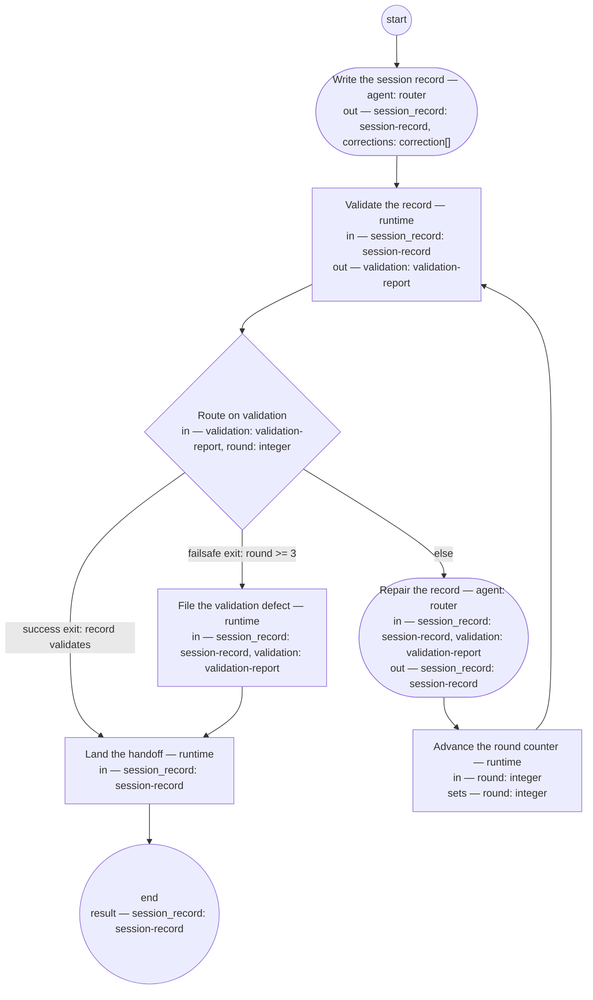

# Process: Session handoff

**Purpose:** Close a conversation so later work starts from governed
records alone — no memory channel, no chat summary, and no transcript as
the carrier.

**Guiding statement:** State crosses sessions only inside governed
artifacts. A fact worth remembering has a governed home; a durable
correction amends the definition it corrects, never a memory.

**Outcomes:**
- O1. The session record validates against its type — witnessed by the
  `validate` run and the `route-validation` branches.
- O2. The record and the work registry are pushed — witnessed by the
  atomic `land` run.
- O3. Every durable correction is filed as an amendment bead targeting
  the definition it corrects, and the record only points at those beads —
  witnessed by the check on `collect`.
- O4. A record that cannot validate within the round cap lands anyway
  with a filed defect, so the handoff never silently fails — witnessed by
  the failsafe branch and `file-defect`.

**Roles:** router (Accountable — runs the handoff when a conversation
closes). The consumer is the router that next touches the work: the
start drain reads the anchor before accepting it.

**Scope note:** one run closes one discovery conversation, whose anchor
is a session record. Review and work conversations close through their
own anchors — decisions land as changes in the artifacts they affect, work discussion lands
on the work item — under the same discipline: the anchor is the only
carrier. A transcript that ends mid-conversation is not a close; the
conversation stays open until its anchor says otherwise.

## Flow (compiled)

Generated from the steps below by `tools/compile_process.py`; do not
edit by hand.




## Data

Each entry names a process-local value. Simple types use JSON Schema
names inline; every structured shape is a `$ref` to a defined type with
an explicit source — `from:` links the defining file, or names the owning
package as `pkg:<package>/<type>` (fetched through that package's
contract tool).

```yaml
data:
  session_record: {$ref: session-record, from: pkg:shopsystem-knowledge/session-record}
  corrections: {type: array, items: {$ref: correction, from: ../types/correction.md}}
  validation: {$ref: validation-report, from: ../types/validation-report.md}
  round: {type: integer, initial: 1}
```

## Steps

```yaml
start: collect
result: session_record
steps:
  - id: collect
    name: Write the session record
    run-by: {role: router, execution: agent}
    inputs: []
    outputs: [session_record, corrections]
    checks:
      - corrections.all(c, c.target != "" && c.bead != "")
    prompt: |
      Write or update the session record: outcome first; the produced and
      revised lists complete; every open thread names its next ready
      action. For each durable correction met this session — a rule,
      preference, or mode change that should outlive the session — file a
      bead targeting the definition it amends and list the pair here. The
      record points; the definition carries. Nothing goes to a memory
      channel: memory writes are frozen.
    next: validate

  - id: validate
    name: Validate the record
    run-by: {execution: runtime}
    inputs: [session_record]
    outputs: [validation]
    run: |
      shop-knowledge validate ${session_record.path}
    next: route-validation

  - id: route-validation
    name: Route on validation
    run-by: {execution: runtime}
    inputs: [validation, round]
    branches:
      - label: "success exit: record validates"
        when: validation.ok
        next: land
      - label: "failsafe exit: round >= 3"
        when: round >= 3
        next: file-defect
      - else: repair

  - id: repair
    name: Repair the record
    run-by: {role: router, execution: agent}
    inputs: [session_record, validation]
    outputs: [session_record]
    prompt: |
      Repair every named violation in the validation errors. Do not
      remove content to pass validation — a section the schema demands is
      written, not deleted.
    next: advance-round

  - id: advance-round
    name: Advance the round counter
    run-by: {execution: runtime}
    inputs: [round]
    set:
      round: round + 1
    next: validate

  - id: file-defect
    name: File the validation defect
    run-by: {execution: runtime}
    inputs: [session_record, validation]
    run: |
      bd create --title "Session record failed validation at handoff: ${session_record.id}" \
        --body "${validation.errors}"
    next: land

  - id: land
    name: Land the handoff
    run-by: {execution: runtime}
    atomic: true
    inputs: [session_record]
    run: |
      git add -A && git commit -m "Session handoff: ${session_record.id}"
      bd dolt push
      git push
    next: end
```

## Derived checks

| Outcome | Check | Kind | Where |
|---|---|---|---|
| O1 | validation ran; success branch requires `validation.ok` | mechanical | `route-validation` |
| O2 | commit, registry push, and git push are one atomic act | mechanical | `land.atomic` |
| O3 | every correction row carries a target and a bead | mechanical | `collect.checks` |
| O4 | failsafe lands with a filed defect, never a silent drop | mechanical | `file-defect.run` |

## Document History

| Version | Date | Kind | Entry |
|---|---|---|---|
| 1 | 2026-08-21 | update | Authored (seed layer); earlier history, if any, in the repository history. |
| 1 | 2026-08-22 | state | draft → approved. |
| 2 | 2026-08-23 | update | Owner direction: decision-ledger references removed — changes stand on their own; history entries and text no longer cite numbered decisions. |
