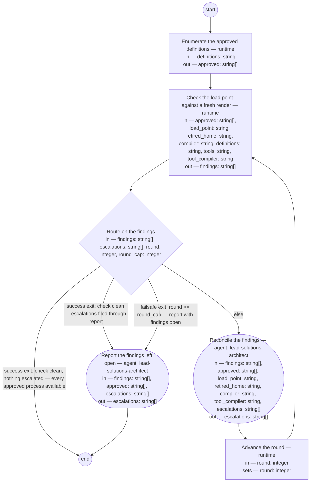

# Process: Skill rendering

**Purpose:** Make every approved process definition of the lead shop,
and every framework tool of the lead shop that answers the standard
question, available at the agent's load point — the `.claude/skills/`
directory the harness loads skills from — by checking what stands
there against a fresh render of each approved definition and a fresh
production from each tool's answer, and reconciling every difference
through the compiler of that source kind, so that an agent beginning
an activity operates from the approved definition of that activity
and an agent running a tool operates from what the tool now says
about itself: placement at the load point is what makes the skill
load, and a clean check is the shop's evidence that every approved
process and every answering tool is available.

**Guiding statement:** A rendering is never the source of truth.
Whatever stands at the load point that a fresh render of an approved
definition, or a fresh production from a tool's answer, would not put
there is a finding, and every finding resolves toward the source — a
re-render, a removal, or the owner's decision on the definition —
never an edit to a skill.

**Outcomes:**
- O1. Every approved process definition has its loadable skill at the
  load point, byte-equal to a fresh render of that definition —
  witnessed by `route`'s clean-check exits on empty `findings`.
- O2. An agent beginning an activity loads that activity's skill:
  availability is placement at the load point, and a skill absent from
  it is a `missing` finding, never assumed loadable — witnessed by
  `check`'s run and `reconcile`'s renders into `load_point`.
- O3. A definition that does not stand approved yields no loadable
  skill: `enumerate` admits only approved definitions, and a skill
  whose source names a definition in `definitions` that does not
  stand approved is a `stale` finding removed at reconciliation —
  witnessed by `enumerate`'s run and the stale rows of `findings`
  consumed by `reconcile`.
- O4. Every finding names its process, or its path in the rendering
  home it stands in, and reaches its consumer — the reconciliation
  (re-render or removal) or the owner: a definition that will not
  compile or names no skill id lands as a review entry in that
  definition's Document History, and a load-point skill that is no
  process rendering is `unrecognized` — escalated by its path, never
  removed. An escalation never ends with the run: a clean check with
  escalations standing routes through `report`, which files each row
  into the governed record the owner reads — witnessed by `check`'s
  output, `route`'s clean-with-escalations branch, and the `reconcile`
  and `report` prompts with `escalations`.
- O5. The load point is the one rendering home: a second home standing
  is a finding, its removal is a reconciliation act, and the index
  amendment it demands is filed to the owner, never made here —
  witnessed by the `second-home` row of `findings` and
  `reconcile`'s prompt.
- O6. Every framework tool under the lead shop's tools directory that
  answers the standard question has its skill at the load point,
  byte-equal to a fresh production from the answer the tool now gives
  — "current with" decided by asking the tool again, never from a copy
  kept since the last production and never from the tool's source; a
  tool skill whose tool no longer answers is a `no-answer` finding,
  escalated by tool and path, never removed — witnessed by `check`'s
  tool loop (`tool-missing`, `tool-diverged`, `no-answer`) and
  `reconcile`'s re-production into `load_point`.

**Roles:** reconciler and reporter —
[`../roles/lead-solutions-architect.md`](../roles/lead-solutions-architect.md)
(the compilers and the lint are this role's apparatus; it consumes the
check's findings, and its resulting action per finding is a re-render
or re-production, a removal, or an escalation). The owner — the product authority —
decides every escalated definition change; that decision lands through
governed evolution, not through a step of this process. The check
itself is mechanical and runs by the runtime against the approved
definitions and the compiler's rendering contract, so the definition
of good sits outside the role that reconciles.

**Carried by:** `.claude/skills/skill-rendering/SKILL.md` — generated
from this definition by
[`../tools/compile_process.py`](../tools/compile_process.py), never
edited by hand. Self-referential by design: this process renders its
own carrier like every other approved definition, and its first run
creates it. Until that first run the carrier does not exist, so its
correspondence to this definition cannot be walked at screening time:
the bootstrap is accepted for the draft, and the process's own first
run — its check against a fresh render — is the check of that
correspondence.

## Flow (compiled)

Generated from the steps below by `tools/compile_process.py`; do not
edit by hand.




## Data

Each entry names a process-local value. Simple types use JSON Schema
names inline; conditions are CEL expressions over these names. Paths
are relative to the lead shop's repository root, the run's working
directory. The *loadable form* of a process definition is the skill
the compiler generates from it under the process-definition typedef's
rendering contract — front-matter carrying `generated: true`, its
source and `source-digest`, and a body of the purpose, guiding
statement, diagram, and every step with its prompt verbatim; the term's
glossary entry is a filed gap (lead-36apr). `definitions` names the
directory of the lead shop's process definitions and nothing else;
`load_point` is the one rendering home — the directory the harness
loads skills from, so placement there is availability. `retired_home`
is the second rendering home this process retires so that no second
copy can diverge: while the directory exists its presence is a
finding, its removal belongs to `reconcile`, and the amendments the
removal demands — the basis index's `skills/` entry and every Carried
by reference still pointing there — are resulting actions filed to
the owner, never edits this process makes. The compiler has no mode that
skips its in-document diagram write, so `check` compiles a scratch
copy of each definition — the copy keeps its basename, since the
compiler derives the skill's source field from the file name, and the
scratch directory links the sibling type and artifact directories so
the copy's data references resolve as its subject's would — and
the write lands on the copy: the check never mutates its subject, and
the definition itself is written only at reconciliation's re-render,
where that write is the point. A `run` step that exits nonzero is a
failed step, not an empty result: the run halts at that step and the
failure is reported to the reconciler role — it is never read as empty
`findings` and never routed as a clean check. The banned vocabulary
a rendered prompt closes with — the line "Do not use these words:"
and the list, in every step run by an agent — is loaded by the
compiler from the lint at `basis/tools/lint_basis.py`, its one home,
under the name `BANNED`; neither the compiler nor this definition
holds a copy, so a change to the lint's list reaches every skill at
the next re-render. An
approved definition that names no `carried-by` skill id cannot render
— at authoring time seven approved definitions stand so — and each is
a first-run finding escalated to the owner. The second source kind at
the load point is a *framework tool*'s answer to the standard question
(the glossary's term; [adr-2026-09-07-tool-answer](../../decisions/adr-2026-09-07-tool-answer.md)
§2): `tools` names the directory of the lead shop's own tools and
nothing else, and `tool_compiler` the compiler that asks a tool the
question by running it with `--describe`, validates the answer against
the tool-description data type
([`../types/tool-description.md`](../types/tool-description.md)), and
produces the skill from the answer and from nothing else, stamped
`source` (the tool) and `source-digest` (over the answer's bytes).
`check` asks every tool under `tools` afresh each run — the answer is
never kept between runs, and the tool's source is never read — and
expects a skill only of a tool that answers: a tool that cannot answer
yields no row here, its gap being recorded to its owner through the
initiative that brings the tool to answer (init-tool-skills' second
feature), not by this process. A load-point skill whose `source` is a
tool under `tools` is read by that source kind: re-asked and
re-produced to scratch, diffed, and reported `tool-diverged` naming
the tool when the texts differ, `no-answer` naming the tool and the
path when the tool no longer produces a skill of that name;
`unrecognized` is reserved for a source that is neither a process
definition nor a tool. The run declares no
`result`: `produces` is empty because the run's value is state change
— every approved definition available at the load point — and O1's
witness pins it.

```yaml
data:
  definitions: {type: string, format: uri-reference, initial: basis/processes}
  compiler: {type: string, format: uri-reference, initial: basis/tools/compile_process.py}
  load_point: {type: string, format: uri-reference, initial: .claude/skills}
  tools: {type: string, format: uri-reference, initial: basis/tools}
  tool_compiler: {type: string, format: uri-reference, initial: basis/tools/compile_tool.py}
  retired_home: {type: string, format: uri-reference, initial: basis/skills}
  approved: {type: array, items: {type: string}, initial: []}
  findings: {type: array, items: {type: string}, initial: []}
  escalations: {type: array, items: {type: string}, initial: []}
  round: {type: integer, initial: 1}
  round_cap: {type: integer, initial: 3}
```

## Steps

```yaml
start: enumerate
steps:
  - id: enumerate
    name: Enumerate the approved definitions
    run-by: {execution: runtime}
    inputs: [definitions]
    outputs: [approved]
    run: |
      grep -l '^status: approved' ${definitions}/*.md | sort
    next: check

  - id: check
    name: Check the load point against a fresh render
    run-by: {execution: runtime}
    inputs: [approved, load_point, retired_home, compiler, definitions, tools, tool_compiler]
    outputs: [findings]
    run: |
      scratch=$(mktemp -d)
      mkdir -p "$scratch/defs" "$scratch/tools"
      ln -s "$PWD/basis/types" "$scratch/types"
      ln -s "$PWD/basis/artifacts" "$scratch/artifacts"
      for def in ${approved}; do
        pid=$(sed -n 's/^id: //p' "$def" | head -1)
        name=$(sed -n 's/^carried-by: //p' "$def" | sed 's/-skill$//')
        if [ -z "$name" ]; then echo "missing $pid no-skill-id"; continue; fi
        copy="$scratch/defs/$(basename "$def")"
        cp "$def" "$copy"
        if ! python3 ${compiler} "$copy" --skill "$scratch/$name/SKILL.md" >/dev/null 2>&1; then
          echo "will-not-compile $pid"; continue
        fi
        if [ ! -f "${load_point}/$name/SKILL.md" ]; then echo "missing $pid"; continue; fi
        diff -q "$scratch/$name/SKILL.md" "${load_point}/$name/SKILL.md" >/dev/null 2>&1 || echo "diverged $pid"
      done
      for tool in ${tools}/*.py; do
        out=$(python3 ${tool_compiler} "$tool" --load-point "$scratch/tools" 2>/dev/null) || continue
        name=$(printf '%s\n' "$out" | sed -n 's/.*: generated from \([^ ]*\) .*/\1/p')
        [ -n "$name" ] || continue
        if [ ! -f "${load_point}/$name/SKILL.md" ]; then echo "tool-missing $tool"; continue; fi
        diff -q "$scratch/tools/$name/SKILL.md" "${load_point}/$name/SKILL.md" >/dev/null 2>&1 || echo "tool-diverged $tool"
      done
      for f in "${load_point}"/*/SKILL.md; do
        [ -f "$f" ] || continue
        src=$(sed -n 's/^source: //p' "$f")
        case "$src" in
          ${definitions}/*)
            printf '%s\n' ${approved} | grep -qxF -- "$src" || echo "stale $src $f" ;;
          ${tools}/*)
            [ -f "$scratch/tools/$(basename "$(dirname "$f")")/SKILL.md" ] || echo "no-answer $src $f" ;;
          *) echo "unrecognized $f" ;;
        esac
      done
      if [ -d "${retired_home}" ]; then echo "second-home ${retired_home}"; fi
      rm -rf "$scratch"
    next: route

  - id: route
    name: Route on the findings
    run-by: {execution: runtime}
    inputs: [findings, escalations, round, round_cap]
    branches:
      - label: "success exit: check clean, nothing escalated — every approved process available"
        when: size(findings) == 0 && size(escalations) == 0
        next: end
      - label: "success exit: check clean — escalations filed through report"
        when: size(findings) == 0
        next: report
      - label: "failsafe exit: round >= round_cap — report with findings open"
        when: round >= round_cap
        next: report
      - else: reconcile

  - id: reconcile
    name: Reconcile the findings
    run-by: {role: lead-solutions-architect, execution: agent}
    inputs: [findings, approved, load_point, retired_home, compiler, tool_compiler, escalations]
    outputs: [escalations]
    prompt: |
      Act on each row of findings by kind, skipping any definition
      or tool already named in escalations. "diverged", or "missing"
      with a skill id: re-render — run
      `python3 ${compiler} <definition> --skill
      <load_point>/<name>/SKILL.md`, the definition's path from
      approved and <name> its carried-by id without the -skill suffix;
      the render overwrites whatever stands, a hand-edit included —
      reconciliation is the re-render, never an edit to the skill.
      "tool-diverged" or "tool-missing": re-produce — run
      `python3 ${tool_compiler} <tool> --load-point <load_point>`, the
      tool's path from the row; the compiler asks the tool again and
      writes the skill from the fresh answer over whatever stands, a
      hand-edit included — never edit the skill, never edit the
      tool's answer to agree with a skill. "no-answer": do not remove;
      the tool named no longer produces a skill of that name — it
      cannot answer, or answers under another name — so add the row's
      tool and path to escalations as the owner's to decide. "stale": remove that skill's directory from the load point — its
      source names a process definition that does not stand approved,
      so nothing of it stays loadable. "unrecognized": do not remove;
      the skill is no rendering of any process definition, so add its
      path to escalations as the owner's to decide. "second-home":
      remove the retired home directory, then add to escalations the
      fixed notice: "the retired home is removed; the owner is to
      amend the basis index's skills/ entry and sweep for any Carried
      by reference still naming the retired home" — no sweep by this
      step. "will-not-compile", or "missing"
      marked no-skill-id: do not retry; write a review entry into that
      definition's Document History naming this process and the
      defect, and add the definition's path with the entry to
      escalations. Return escalations.
    next: advance-round

  - id: advance-round
    name: Advance the round
    run-by: {execution: runtime}
    inputs: [round]
    set:
      round: round + 1
    next: check

  - id: report
    name: Report the findings left open
    run-by: {role: lead-solutions-architect, execution: agent}
    inputs: [findings, approved, escalations]
    outputs: [escalations]
    prompt: |
      This step files what leaves the run for the owner; it runs at
      the round cap with findings open, or on a clean check with
      escalations standing. For each row of findings still open whose
      definition is not yet named in escalations, write a review entry
      into that definition's Document History — the definition's path
      from approved — naming this process and the finding, and add the
      path with the entry to escalations; a row naming no definition —
      an unrecognized skill — goes to escalations by its path alone.
      Then confirm every escalation row stands in a governed record
      the owner reads: a row naming a definition, as the review entry
      in that definition's Document History; a path-only row — an
      unrecognized skill, the second-home notice — lands in this
      process definition's Document History entry for the run. The
      resulting action on each escalated row is the owner's decision.
      Return escalations.
    next: end
```

## Derived checks

| Outcome | Check | Kind | Where |
|---|---|---|---|
| O1 | the run ends only on `size(findings) == 0`, and with `escalations` standing the clean check routes through `report` | mechanical | `route` branches |
| O2 | every approved definition without its skill at the load point yields a `missing` row; renders land only under `load_point` | mechanical | `check.run`, `reconcile.prompt` |
| O3 | `enumerate` admits only `status: approved`; the scan covers every skill at the load point, marks `stale` only a source under `definitions`, and `reconcile` removes each `stale` row | mechanical | `enumerate.run`, `check.run`, `reconcile.prompt` |
| O4 | each finding row names its process or its path in the rendering home it stands in; a will-not-compile, no-skill-id, or unrecognized row lands in `escalations` — the first two as review entries in the named definition's Document History, the unrecognized row by its path and never removed; every escalation row lands in a governed record, the named definition's Document History or this definition's run entry for a path-only row | judged | `check.run`, `route` branches, `reconcile` and `report` prompts |
| O5 | a `second-home` row stands while `retired_home` exists; its removal and the filed index amendment are directed in `reconcile.prompt` | judged | `check.run`, `reconcile.prompt` |
| O6 | `check` runs every tool under `tools` with `--describe` through `tool_compiler` on each run and keeps no answer between runs; a tool that produces a skill to scratch with none at the load point yields `tool-missing`, a differing text `tool-diverged`, each naming the tool; a load-point skill sourced under `tools` whose tool produced no skill of that name yields `no-answer` by tool and path, escalated and never removed; `reconcile` re-produces through `tool_compiler` and never edits | mechanical | `check.run`, `reconcile.prompt` |

## Document History

| Version | Date | Kind | Entry |
|---|---|---|---|
| 1 | 2026-09-02 | update | Authored under init-skills-availability's assigned feature feat-skills-availability as the initiative's deliverable, per the authority's scope ruling: "This should itself be a process." One rendering home decided — the agent's load point, `.claude/skills/` — with `basis/skills/` retired by the run and the index amendment filed to the owner as a resulting action; the seven approved definitions naming no skill id are first-run findings for the owner; "loadable form" defined in Data pending its glossary entry (lead-36apr). |
| 2 | 2026-09-02 | review | Round 1 (judge: claude-fable-5 / process-definition screen): findings — the second-home row named no process (O4 scoped to process-or-home, table aligned); the stale scan read a field the loadable form does not define (source: adopted); the compiler path undeclared (declared as data); the absent carrier (held for the owner). |
| 3 | 2026-09-02 | review | Round 2: findings — the second-home escalation needed undeclared reads (constant text now); the stale scan could remove a non-rendering skill (narrowed to sources under definitions; unrecognized escalated, never removed); the carrier finding carried. |
| 4 | 2026-09-02 | review | Round 3, the cap: findings — escalations could end with the run (success exit now routes through report on non-empty escalations, rows filed to governed records); the check mutated a stale diagram (compile-to-scratch only); the carrier finding to the owner. Post-cap repairs disclosed; the next screen of this file covers them. |
| 4 | 2026-09-02 | state | draft → approved: the owner's decision of 2026-09-02, on the recommended path. Bootstrap exemption recorded: the self-referential carrier does not exist before the first run; its correspondence check is that run's own check against a fresh render — accepted as this screening's exemption. |
| 4 | 2026-09-02 | update | First run over the corpus (the report step at the round cap): 10 skills rendered at the load point — 9 missing created, the hand-diverged stakeholder-presentation re-rendered over its edit, the carrier skill-rendering created (the bootstrap exemption's deferred check passed: the round-2 check diffed the carrier clean against a fresh render) — and the retired home basis/skills/ removed. Escalations: the fixed second-home notice — the retired home is removed; the owner is to amend the basis index's skills/ entry and sweep for any Carried by reference still naming the retired home (ten definitions' Carried by links read as broken by the lint until that sweep) — and seven approved definitions naming no carried-by skill id (corpus-close-out, definition-chain-migration, discovery-conversation, reconcile-and-close, review-conversation, session-handoff, work-conversation), each with the review entry written into its Document History. No unrecognized path, no will-not-compile. Check clean: no — the seven no-skill-id findings stood at the cap. |
| 5 | 2026-09-02 | update | Second run, invoked through its own carrier at the load point: the owner amended the seven no-skill-id definitions (carried-by added, each with its history row), round 1 found 7 missing and 10 diverged (every definition had changed after its render — the Carried-by sweep and the amendments), reconcile re-rendered all 17, round 2 clean with nothing escalated — the first success exit. Every approved process is available: 17 of 17, zero divergence. Consistency-maintenance process filed as backlog bead lead-dyz0o. |
| 6 | 2026-09-04 | update | Owner's ruling of 2026-09-04 on brief-034 ask 4 (lead-xmuft), applied: a nonzero step exit is a failed step, not an empty result; compilers emit a will-not-compile row for a path they cannot read instead of crashing. |
| 7 | 2026-09-05 | update | req-2026-09-05-banned-words-inlined, applied at the small-change lane's make step: the compiler inlines the banned line — "Do not use these words: " and the lint's list — into every agent-run step's prompt block of every rendered skill; the list is loaded from the lint at basis/tools/lint_basis.py, its one home, named in Data. |
| 8 | 2026-09-07 | update | Under init-tool-skills / feat-tool-skills, the fourth item of guidance/feat-tool-skills-shopsystem-product.md (v1), per adr-2026-09-07-tool-answer (v3, checked) §3's third consequence: the load point's second source kind recognized — a framework tool's answer to the standard question. The process owner's choice the guidance names (amend this definition, or define a sibling process for tool skills) taken by its default here, one load point having one check, and raised to the owner with this entry. Data gains `tools` and `tool_compiler` (basis/tools/compile_tool.py, in the tree before this amendment, as the process-definition typedef's commitment requires); `check` asks every tool under `tools` afresh each run through the compiler and diffs a fresh production against what stands — `tool-missing`, `tool-diverged`, each naming the tool — and reads a load-point skill sourced under `tools` by that kind, `no-answer` when its tool no longer produces a skill of that name, `unrecognized` now reserved for a source that is neither; `reconcile` re-produces a tool skill through the compiler and escalates `no-answer`; O6 and its derived check added; purpose, guiding statement, and use-when widened to the second kind. No exemption, no skip list: the lint's skill is reported current or diverged like any process skill. A tool that cannot answer yields no row — its gap is init-tool-skills' second feature's. Made by the lead-solutions-architect role; screened by hand against the process-definition typedef (v7) checklist — refs resolve, the loop's exits unchanged, no prose outside prompts, every tool a step names exists (`python3 basis/tools/lint_basis.py --process basis/processes/skill-rendering.md` passes), O6 names its witness. |
