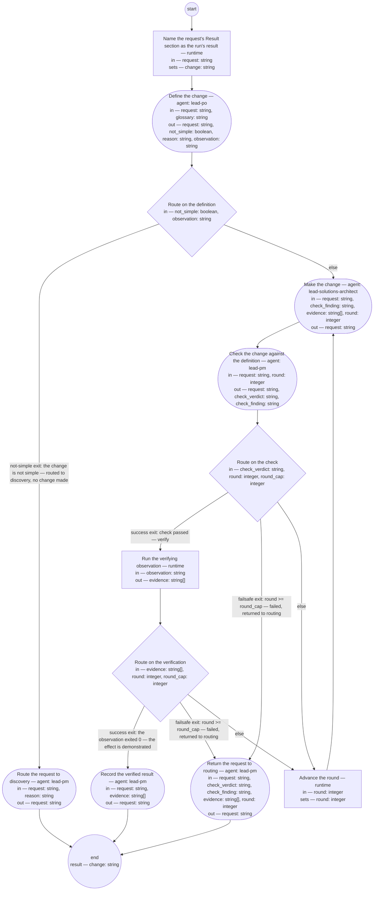

# Process: Small change

**Purpose:** Take a request whose route is the small-change lane to a
verified result: the lead-po role defines the change up front on the
request — what will be different when it is done, and the observation
that will show it in the running system; the maker role makes it
through the changed artifacts' own producing rules; the lead-pm role,
never the maker, checks the change against that definition; the
runtime runs the observation the definition named; and the lead-pm
role records the verified result on the request. No bet is taken and
no check of record is run in this process: both protect an
initiative's appetite, and a simple change — the glossary's term, the
feature's Vocabulary — spends no appetite worth a bet. What the lane
keeps of the product flow's discipline is the working principles':
the definition of good stated before the work, the check with a role
other than the maker's, and done meaning demonstrated.

**Guiding statement:** The definition on the request is the whole of
what good looks like for the change: the maker makes to it, the
checker judges by it, the observation it names is what counts as
verified, and a change the definition does not cover is not made.
Everything the run decides lands on the request or in the changed
artifacts' own histories; nothing binding lives only in the
transcript.

**Outcomes:**
- O1. The change is defined before it is made, by the lead-po role, on
  the request: the definition opens with the request's id, states
  what will be different as acceptance statements, names the maker
  role and the verifying observation, and stands before any artifact
  is touched — witnessed by `define`'s run-by and prompt, and by the
  step order: `make` is reachable only through `route-definition`'s
  else branch, after `define` (feature scenario *a simple change is
  defined up front before it is made*).
- O2. The change is checked against its definition by a role other
  than the maker: `make` runs by `lead-solutions-architect` and
  `check` by `lead-pm`, two role ids fixed in this definition, and the
  verdict is written on the request by the checker with its role —
  witnessed by the two steps' run-by and `check`'s prompt (feature
  scenario *a simple change is checked by a role other than its
  maker*).
- O3. The result counts done only when the observation the definition
  named shows the effect in the running system, and the request then
  records the verified result with its evidence; between the request
  and that result no bet is taken and no check of record is run —
  witnessed by `route-verify`'s success exit, which requires the
  observation's `exit 0` as the last line of `evidence`, by `record`'s
  prompt, and by the step list, which carries no bet step and no step
  run by the cold-reviewer role (feature scenarios *a simple change
  reaches a verified result with no bet and no check of record* and
  *the example change reaches a verified result through the lane*).
- O4. A change found not simple once defined leaves the lane for a
  discovery conversation with the reason, and the lane makes no change
  for it: the route is changed by the lead-pm role and by no other —
  witnessed by `route-definition`'s not-simple exit, which precedes
  `make`, and `reroute`'s prompt (feature scenario *a request whose
  change turns out not simple is routed to discovery*).
- O5. Every run ends in one of three stated states on the request —
  done, routed to discovery, or returned to routing with the findings
  recorded — returns `change`, the request's Result section, to the
  caller, and the make-check-verify loop is capped — witnessed by the
  three steps that reach `end` (`record`, `reroute`, `hand-back`),
  each writing its state on the request, by `name-result`'s `set`, and
  by the failsafe rows of `route-check` and `route-verify`.

**Roles:** the definer —
[`../roles/lead-po.md`](../roles/lead-po.md) (writes the change's
definition on the request; the definition is a requirement, and this
role makes the requirements; it makes nothing else here). The maker —
[`../roles/lead-solutions-architect.md`](../roles/lead-solutions-architect.md)
(makes the change; the lane's scope — the glossary's *simple change* —
is the lead shop's own definitions, one instance of them, and the
tools that render them, and this role holds those: the compilers and
the lint are its apparatus, as the skill-rendering and role-rendering
processes record). The checker and recorder —
[`../roles/lead-pm.md`](../roles/lead-pm.md) (checks the change
against the definition, records the verified result, and alone
changes the request's route or status — the request typedef's writer
rules; the role the authority holds in person). The maker is fixed in
`make`'s run-by, not passed in: a step's run-by is a literal role id
under the process-definition typedef, and fixing both `make`'s and
`check`'s roles is what makes *the checker is never the maker* a
mechanical fact of this definition rather than a value a caller could
set to the same role. A change whose maker must be another role is a
change to this definition — a make step for that role — filed as the
definition gap it is, never a run-time substitution. The cold-reviewer
role has no step here: no check of record is run.

**Carried by:** `.claude/skills/small-change/SKILL.md` — generated
from this definition by
[`../tools/compile_process.py`](../tools/compile_process.py), never
edited by hand, and placed at the skills load point by the
[skill-rendering](skill-rendering.md) process once this definition
stands approved. Until that run the carrier does not exist, so its
correspondence to this definition cannot be walked at screening time:
skill-rendering's own check — a fresh render diffed against what
stands — is the check of that correspondence, as it is for every
approved process.

## Flow (compiled)

Generated from the steps below by `tools/compile_process.py`; do not
edit by hand.




## Data

Each entry names a process-local value. Simple types use JSON Schema
names inline; conditions are CEL expressions over these names. Paths
are relative to the lead shop's repository root, the run's working
directory. The definition of good for this process is the feature
[feat-request-routing](../../features/feat-request-routing.md); each
outcome names the scenarios it witnesses. *Simple change*,
*small-change lane*, *request* (the received-ask sense), and *check of
record* are the [glossary](../glossary.md)'s terms; `glossary` is
declared as data so that `define` judges simpleness against the term's
one home and loads nothing else.

`request` is the path of the request the lane takes up — an instance
of the [request typedef](../artifacts/request.md)'s received-ask path,
its `route` `small-change`. This process runs as a sub-process of the
[request-intake](request-intake.md) process: its `open-lane` step maps
`request` to this parameter and receives this run's `result` as
`change`; the run is anchored to the parent's run and to the work
item intake opened for the routed ask (the request's `work-item`
field), which intake closes on the lane's return in its
`close-routed` step — this process closes no work item and writes no
`routed-to`, since one writer of each stands in the parent. The
intake is the lane's one caller: the request typedef names the lane
as where the route leads, and no anchor of its own is defined here.
The run's `result` is `change`: the request's Result section by
fragment, `<request>#result` — the one place the definition, the check,
and the verified result stand, or, on an exit before the result, the
entry that records why; it is the artifact carrying what the run
produced, not a status record, and it is never empty, since every exit
writes that section. `produces` is empty because the run creates no
artifact — the change lands in artifacts of their own types, and the
request already exists.

**Where the definition lives.** The change's definition is written on
the request itself, in its Result section (the typedef's section 4),
and nowhere else. The alternative — a file of its own under a
`changes/` directory referencing the request — was not taken, under
`single-source-of-truth` and the feature's constraints C1 and C3: a
separate file is a second home that must reference the request and be
referenced back, an artifact with no type (the initiative's no-go: no
new types), and a document a reader must find from the request rather
than read on it. On the request, the definition references the request
by being part of it — it opens with the request's id — and every
later entry (the change made, the check, the verified result) sits
beside it, so the request reads as one record from the originator's
words to the demonstrated effect. `change` names that section, and
the intake process's `record-route` step writes it into the request's
`routed-to` — the typedef's "a change definition" as the place the
route led. The Result section carries four entries under headings of this process's naming:
*Definition* (written by `define`), *Change made* (by `make`, one entry
per round), *Check* (by `check`, one per round), and *Verified result*
(by `record`) — or, on an exit before the result, the entry `reroute`
or `hand-back` writes.

**What a step reads and writes.** A step reads only what it lists.
The artifacts the definition names by path are read and written
through the declared input `request` — the definition on it is what
names them — as the skill-rendering and role-rendering processes read
and write the definitions listed in their `approved` input; no output
is declared for them, and their own Document History rows carry each
change, citing the request by id: the request references the changed
artifacts, the artifacts reference the request, and neither restates
the other. A definition or typedef is amended under its owner's
decision: for a definition the product authority owns, the decision is
the route recorded on the request by the lead-pm role, on the
authority's ruling recorded in
[adr-2026-09-04-request-front-end](../../decisions/adr-2026-09-04-request-front-end.md)
that the lead-pm is an extension of the authority; the history row
names the request. A rendering — a skill, a subagent file, a compiled
diagram — is never edited by hand; it is re-rendered from its source,
the rendering processes' rule. `make` never edits the definition: a
definition found wrong is a `check` finding that stands to the cap,
and the failed exit returns the request to routing.

**Verification.** The *verifying observation* the definition names is
one command, run from the repository root, whose exit status 0 shows
the change's effect in the running system — a lint over the corpus, a
compiler's check, a check step of another process, a headless
fresh-session demonstration — and whose output is the evidence.
`verify` runs it as `observation` and yields `evidence`: the command's
output lines, standard error merged, then one closing line `exit <n>`
carrying the command's exit status. The observation's nonzero exit is
a failed verification — a finding routed back to `make` under the
cap, never a halted run — while a nonzero exit of a `run` step itself
(the shell failing, `bd` refusing, the anchor missing) is a failed
step, not an empty result: the run halts at that step and the failure
is reported to the lead-pm role, the sibling processes' rule. `round`
counts make rounds and is shared by the check and the verification:
a fail from either advances it, and `round_cap` bounds both together.

**Exit states.** Each exit writes its state on the request and
returns `change` to the caller; the work item is the parent's to
close, and the evidence stands on the request, so a close reason
cites the request rather than copying it. *Done*: the request's
status `done`, written by `record` — the typedef names this step as
that status's writer. *Not simple*: the route changed to `discovery`
with the reason, status unchanged (`routed`), written by `reroute` —
the typedef's rule that a later change of route is the lead-pm
role's; no artifact touched; the request, its route now discovery, is
the discovery conversation's input, opened on it by the intake
process's dispatch on the run the lead-pm role enters with the
request. *Failed*: the findings standing at the cap recorded on the
request, its route set to `awaiting` with the reason and its status
to `recorded`, so the request is again visible as awaiting its route
and the intake process's route step takes it up; the changed artifacts
are not reverted — a revert is itself a change to governed artifacts
and belongs to the route decided next, and the request records
exactly what stands.
`check_verdict` is `pass` or `fail`; `check_finding` is the statement
or rule that fails, quoted, empty on pass. `not_simple` and `reason`
are `define`'s finding that the change is not simple by the glossary's
test — the lead-pm role judged it simple at routing, and the definer
may find otherwise once the change is defined, the feature's rule.

```yaml
data:
  request: {type: string, format: uri-reference}
  change: {type: string, format: uri-reference}
  glossary: {type: string, format: uri-reference, initial: basis/glossary.md}
  not_simple: {type: boolean, initial: false}
  reason: {type: string, initial: ""}
  observation: {type: string, initial: ""}
  check_verdict: {type: string, enum: [pass, fail]}
  check_finding: {type: string, initial: ""}
  evidence: {type: array, items: {type: string}, initial: []}
  round: {type: integer, initial: 1}
  round_cap: {type: integer, initial: 3}
```

## Steps

```yaml
start: name-result
parameters: [request]
result: change
steps:
  - id: name-result
    name: Name the request's Result section as the run's result
    run-by: {execution: runtime}
    inputs: [request]
    set:
      change: request + "#result"
    next: define

  - id: define
    name: Define the change
    run-by: {role: lead-po, execution: agent}
    inputs: [request, glossary]
    outputs: [request, not_simple, reason, observation]
    prompt: |
      Read the request — its sections 1 to 3: the originator's words,
      the reader, the route and its reason — and the entry for simple
      change in the glossary at glossary; nothing else. First judge
      the change by that entry. If it is not a simple change, return
      not_simple true with the reason, observation empty, and write
      nothing on the request: the lane makes no change for it.
      Otherwise write the change's definition into the request's
      Result section under the heading Definition, opening with the
      request's id: what will be different when the change is done, as
      one or more Given/When/Then acceptance statements a checker can
      decide against the changed artifacts; the artifacts the change
      touches, by path; the maker role — lead-solutions-architect, the
      role the make step runs by; and the verifying observation — one
      command, run from the repository root, whose exit 0 shows the
      effect in the running system and whose output is the evidence.
      The definition says what, never how, and stands before any
      change: you touch no artifact but the request. Bump the
      request's version with the history row. Return the request,
      not_simple false, reason empty, and observation as the command
      exactly as written.
    next: route-definition

  - id: route-definition
    name: Route on the definition
    run-by: {execution: runtime}
    inputs: [not_simple, observation]
    branches:
      - label: "not-simple exit: the change is not simple — routed to discovery, no change made"
        when: not_simple
        next: reroute
      - else: make

  - id: make
    name: Make the change
    run-by: {role: lead-solutions-architect, execution: agent}
    inputs: [request, check_finding, evidence, round]
    outputs: [request]
    prompt: |
      Read the Definition in the request's Result section and the
      artifacts it names by path — nothing else; the definition is not
      yours to edit. Make the change so that every acceptance
      statement holds, through each artifact's own producing rules: a
      definition or typedef amended under the decision the request
      records, with its Document History row citing the request by id
      and its version bumped; its schema changed where the definition
      names one; a tool changed together with the definition that
      names it; a rendering never edited by hand — re-rendered from
      its source. Make nothing the definition does not cover. When
      check_finding is not empty this is a repair round: repair what
      it quotes. When evidence is not empty and check_finding is, the
      verifying observation failed: read the evidence and repair the
      cause. Write under Change made in the request's Result section,
      one entry for this round: your role as maker, every path
      changed with its version before and after, and round. Return
      the request.
    next: check

  - id: check
    name: Check the change against the definition
    run-by: {role: lead-pm, execution: agent}
    inputs: [request, round]
    outputs: [request, check_verdict, check_finding]
    prompt: |
      Read the Definition and the Change made entry for round in the
      request's Result section, and the artifacts that entry names —
      nothing else. You are not the maker: the make step runs by
      another role, and your verdict is judged against the definition
      alone, not against what you would have made. For each acceptance
      statement, decide whether the changed artifacts satisfy it; for
      each change, whether it went through the artifact's own
      producing rules — the history row citing the request, the
      version bumped, no rendering edited by hand, nothing made that
      the definition does not cover. Verdict pass only when every
      statement holds and every change conforms; otherwise fail, with
      check_finding the statement or rule that fails, quoted, and what
      fails it. Write under Check in the Result section: the verdict,
      your role, round, and the finding. Return the request, the
      verdict, and the finding — empty on pass.
    next: route-check

  - id: route-check
    name: Route on the check
    run-by: {execution: runtime}
    inputs: [check_verdict, round, round_cap]
    branches:
      - label: "success exit: check passed — verify"
        when: check_verdict == "pass"
        next: verify
      - label: "failsafe exit: round >= round_cap — failed, returned to routing"
        when: round >= round_cap
        next: hand-back
      - else: advance-round

  - id: verify
    name: Run the verifying observation
    run-by: {execution: runtime}
    inputs: [observation]
    outputs: [evidence]
    run: |
      # the observation's own exit status is data — the closing line;
      # this step's exit is nonzero only if the shell itself fails
      ( ${observation} ) 2>&1
      printf 'exit %s\n' "$?"
    next: route-verify

  - id: route-verify
    name: Route on the verification
    run-by: {execution: runtime}
    inputs: [evidence, round, round_cap]
    branches:
      - label: "success exit: the observation exited 0 — the effect is demonstrated"
        when: size(evidence) > 0 && evidence[size(evidence) - 1] == "exit 0"
        next: record
      - label: "failsafe exit: round >= round_cap — failed, returned to routing"
        when: round >= round_cap
        next: hand-back
      - else: advance-round

  - id: advance-round
    name: Advance the round
    run-by: {execution: runtime}
    inputs: [round]
    set:
      round: round + 1
    next: make

  - id: record
    name: Record the verified result
    run-by: {role: lead-pm, execution: agent}
    inputs: [request, evidence]
    outputs: [request]
    prompt: |
      Read the request's Result section and evidence. Write under
      Verified result: the verifying observation the Definition named,
      its evidence — the output lines and the closing exit 0 — the
      date, and your role; state that the Definition, the Check's
      verdict by your role, and this result stand, and that between
      the request and this result no bet was taken and no check of
      record was run. Set the request's status to done; bump its
      version with the history row. Return the request.
    next: end

  - id: reroute
    name: Route the request to discovery
    run-by: {role: lead-pm, execution: agent}
    inputs: [request, reason]
    outputs: [request]
    prompt: |
      Change the request's route to discovery, with reason as its
      route-reason — the status unchanged; write under the Result
      section that the lane defined no change and made none, with the
      reason. The originator reads the changed route and its reason
      from the request, as the first route was read. Bump the
      request's version with the history row. Return the request.
    next: end

  - id: hand-back
    name: Return the request to routing
    run-by: {role: lead-pm, execution: agent}
    inputs: [request, check_verdict, check_finding, evidence, round]
    outputs: [request]
    prompt: |
      The lane reached its round cap with the change unverified. Write
      under the Result section the findings standing at the cap — the
      last check_verdict with check_finding, evidence where the
      observation ran — and round; set the request's route to
      awaiting with the reason "small-change lane failed at the round
      cap" and its status to recorded, so the request is again visible
      as awaiting its route. Revert nothing: the changed artifacts'
      histories stand as the maker wrote them, and the request records
      what stands. Bump the request's version with the history row.
      Return the request.
    next: end
```

## Derived checks

| Outcome | Check | Kind | Where |
|---|---|---|---|
| O1 | `define` runs by `lead-po`, reads only `request` and `glossary`, and writes the definition on the request; no step before `route-definition` writes any other artifact, and `make` is reached only through its else branch | mechanical | `define`, step order, `route-definition` branches |
| O2 | `make.run-by.role` and `check.run-by.role` are two different literal role ids; `check` reads `request` and `round` only and writes the verdict with its role under Check | mechanical | `make`, `check` |
| O3 | the success exit requires the last line of `evidence` to be `exit 0`; `record` writes the verified result with the evidence and sets `done`; no step names a bet and none runs by `cold-reviewer` | mechanical | `route-verify` branches, `record.prompt`, step list |
| O4 | the not-simple branch leaves `route-definition` before `make`; `reroute` runs by `lead-pm` and changes the route with the reason, status unchanged | mechanical | `route-definition` branches, `reroute` |
| O5 | every path to `end` passes through `record`, `reroute`, or `hand-back`, each writing the request's state and returning `request`; `change` is set once by `name-result` as `request + "#result"` and is the declared `result`, so no exit returns empty; both loops carry a labeled success exit and a `round >= round_cap` failsafe, and `advance-round` is the loop's only way back to `make` | mechanical | `name-result.set`, `record`, `reroute`, `hand-back`, `route-check` and `route-verify` branches |
| O1–O3 | the definition says what, not how; the check judges the definition's statements and the producing rules, not the maker's choices; the evidence recorded is the observation's output, not a restatement | judged | `define`, `check`, and `record` prompts |

## Document History

| Version | Date | Kind | Entry |
|---|---|---|---|
| 1 | 2026-09-04 | update | Authored under init-request-routing / feat-request-routing, per adr-2026-09-04-request-front-end (the small-change lane as the second destination, its form the candidate this definition settles), on the authority's standing direction of 2026-09-04, by the lead-solutions-architect role. The lane: define (lead-po, on the request) → make (lead-solutions-architect, fixed) → check (lead-pm, never the maker) → verify (runtime: the observation the definition named; its exit status the closing line of the evidence) → record (lead-pm; status done). Exits: not simple — the route changed to discovery by the lead-pm with the reason, no change made; failed — the cap reached in check or verification, the findings recorded, the request returned to routing; done. Runs as a sub-process of request-intake's `open-lane` step (authored in parallel): the result `change` is the request's Result section by fragment, which intake writes into `routed-to`; the work item is intake's to close, so the lane closes none — the brief's "done: <request id>" close moved to the parent on that contract. No bet, no check of record, no cold-reviewer step, stated with the reason in Purpose. The definition lives on the request's Result section, not in a file of its own, under single-source-of-truth and constraints C1 and C3. The maker is fixed in `make`'s run-by rather than passed as a parameter: a step's run-by is a literal role id under the typedef, and the fixed pair is what makes the checker-never-maker rule mechanical. Draft, not yet screened; the lead-pm orchestrates the cold reviewer. |
