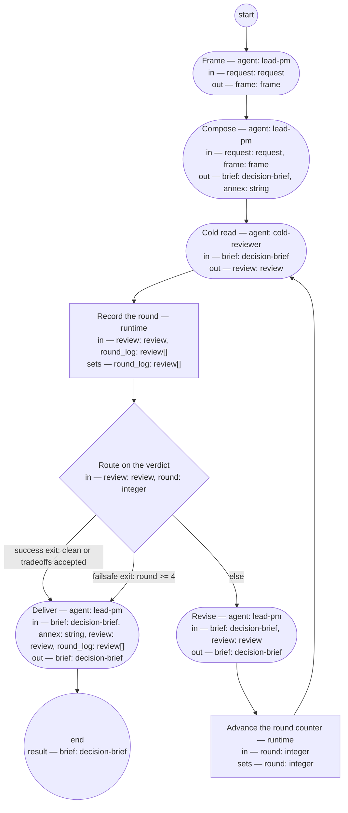

# Process: Stakeholder presentation

**Purpose:** Turn source material into a presentation the product authority
can decide from in one short reading, verified by an independent cold read
before delivery.

**Guiding statement:** Lead with the answer. The reader must get the most
important thing even if they stop after the first paragraph, and must be
able to make every requested decision without opening an annex or the
author's head.

**Outcomes:**
- O1. A presentation exists within budget — witnessed by the checks on
  `compose`.
- O2. Every ask carries a recommendation, inline evidence, and a default,
  and states whether it gates work or resolves on silence — witnessed by
  the check on `frame` and the
  [fitness set](../fitness/decision-brief.fitness.md).
- O3. An independent cold read has returned clean, or flags only
  author-accepted tradeoffs — witnessed by `route-verdict` and the
  `round_log`.
- O4. The original material survives intact as a labeled, linked annex —
  witnessed by the `annex` output of `compose`.

**Roles:** author — lead-pm (Accountable). cold reviewer —
[`../roles/cold-reviewer.md`](../roles/cold-reviewer.md) (Verifier; never
the author).

**Carried by:**
[`../skills/stakeholder-presentation/SKILL.md`](../skills/stakeholder-presentation/SKILL.md)
— generated from this definition by
[`../tools/compile_process.py`](../tools/compile_process.py), never edited
by hand.

## Flow (compiled)

Generated from the steps below by `tools/compile_process.py`; do not
edit by hand.




## Data

Each entry names a process-local value. Simple types use JSON Schema
names inline; every structured shape is a `$ref` to a defined type —
an artifact type in [`../artifacts/`](../artifacts/) or a data type in
[`../types/`](../types/) — never defined here. Field access in conditions
follows the referenced schema; conditions are CEL (Common Expression
Language) expressions over these names.

```yaml
data:
  request: {$ref: request}
  frame: {$ref: frame}
  brief: {$ref: decision-brief}
  annex: {type: string, format: uri-reference}
  review: {$ref: review}
  round: {type: integer, initial: 1}
  round_log: {type: array, items: {$ref: review}, initial: []}
```

## Steps

```yaml
start: frame
result: brief
steps:
  - id: frame
    name: Frame
    run-by: {role: lead-pm, execution: agent}
    inputs: [request]
    outputs: [frame]
    checks:
      - size(frame.asks) <= 7
    prompt: |
      Read the request. Name the reader and every decision the
      presentation must enable. Enumerate the asks; keep only the asks
      that gate the next unit of work, and record the rest as deferrals —
      a deferral is a note, never an ask. Group related asks and order
      them by consequence. If the material holds more decisions than one
      reading can carry, split it by decision, not by topic, and frame
      only the first split.
    next: compose
    annotations:
      fabro: {model: high-reasoning, max_attempts: 2}

  - id: compose
    name: Compose
    run-by: {role: lead-pm, execution: agent}
    inputs: [request, frame]
    outputs: [brief, annex]
    checks:
      - words(brief.decision_layer) <= 400
      - words(brief.decision_layer) + words(brief.support_layer) <= 1500
    prompt: |
      Write the decision and support layers fresh — never abridge the
      source by deletion. Open with situation, complication, question,
      answer in at most four sentences, then the recommendations and the
      asks. Write each ask in four parts: question, recommendation,
      inline evidence, default. State which asks gate work and which
      resolve by default on silence; a block-ratification states what it
      binds. Gloss every proper noun at first mention. Attach every block
      to an ask or label it informational. Demote the original material
      to a labeled annex and link it. Style rules:
      guidelines/stakeholder-communication.md, layered on
      guidelines/base-writing-style.md.
    next: cold-read
    annotations:
      fabro: {model: high-reasoning}

  - id: cold-read
    name: Cold read
    run-by: {role: cold-reviewer, execution: agent, fresh-context: true}
    inputs: [brief]
    outputs: [review]
    prompt: |
      Read the presentation alone; you have not seen the annex or any
      earlier round, and that is the point. Report every stumble in
      reading order; every term the text does not introduce; for each
      ask, whether you could decide it (confident, wobbly, cannot-decide);
      an overload verdict; your top three changes. Verdict "clean" only
      if you found nothing. Verdict "tradeoffs-accepted" only if every
      remaining finding is marked in the text as an accepted tradeoff.
      Otherwise verdict "findings".
    next: log-round
    annotations:
      fabro: {model: high-reasoning, node: separate-context-per-round}

  - id: log-round
    name: Record the round
    run-by: {execution: runtime}
    inputs: [review, round_log]
    set:
      round_log: round_log + [review]
    next: route-verdict

  - id: route-verdict
    name: Route on the verdict
    run-by: {execution: runtime}
    inputs: [review, round]
    branches:
      - label: "success exit: clean or tradeoffs accepted"
        when: review.verdict in ["clean", "tradeoffs-accepted"]
        next: deliver
      - label: "failsafe exit: round >= 4"
        when: round >= 4
        next: deliver
      - else: revise

  - id: revise
    name: Revise
    run-by: {role: lead-pm, execution: agent}
    inputs: [brief, review]
    outputs: [brief]
    prompt: |
      Repair every finding in the review. Then run the consistency
      sweep: counts and cross-references match, and every promise the
      text makes holds against every line that follows it. Mark any
      finding you will not repair as an accepted tradeoff, in the text,
      with one sentence saying why.
    next: advance-round

  - id: advance-round
    name: Advance the round counter
    run-by: {execution: runtime}
    inputs: [round]
    set:
      round: round + 1
    next: cold-read

  - id: deliver
    name: Deliver
    run-by: {role: lead-pm, execution: agent}
    inputs: [brief, annex, review, round_log]
    outputs: [brief]
    prompt: |
      Deliver the brief to the reader with the annex linked. Set the
      brief's status to "delivered" and attach the round log as its
      verified-by record: one line per round with the verdict and the
      judge's model and prompt version. If the final verdict is
      "findings" (the failsafe exit fired), state the open findings at
      the top of the brief before anything else.
    next: end
```

## Derived checks

| Outcome | Check | Kind | Where |
|---|---|---|---|
| O1 | word counts vs budgets | mechanical | `compose.checks` |
| O2 | ask cap after grouping | mechanical | `frame.checks` |
| O2 | ask structure and decidability | judged | [`../fitness/decision-brief.fitness.md`](../fitness/decision-brief.fitness.md), scored in `cold-read` |
| O3 | every round recorded; final verdict is a success exit or marked failsafe | mechanical | `log-round` output, `route-verdict` branches |
| O4 | annex present, labeled, linked | mechanical | `compose` output `annex` |
