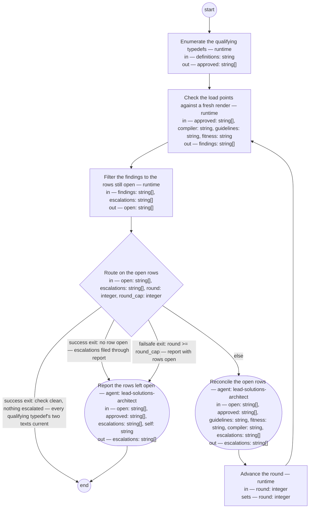

# Process: Typedef rendering

**Purpose:** Keep the two texts of every artifact type current with
the type's one standard. An *artifact type* is a kind of document the
shop produces; its *typedef* is the single source the type is
generated from, a definition under `basis/artifacts/`. A typedef that
stands approved and carries a "Writing rules" section and a "Fitness
scenarios" section is the type's standard, and this process calls such
a typedef *qualifying*. Its two texts are *renderings* — generated
outputs, never edited by hand, never the source: the *guideline*, the
maker's text, the type's writing rules read by whoever makes an
artifact of the type; and the *fitness set*, the checker's text, the
judged Given/When/Then scenarios a check screens an artifact against.
Each stands at a *load point*, the directory its readers read it from:
`basis/guidelines/` for guidelines and `basis/fitness/` for fitness
sets. The process checks what stands at the two load points against a
fresh render of each qualifying typedef by the *compiler*, the lead
shop's tool that produces both texts from a typedef, and reconciles
every difference through the compiler — so that a maker and a checker
of the type work from the same words, a change to the typedef reaches
both texts, and a clean check is the shop's evidence that they do.
The *lead shop* is this repository: the shop that owns the product's
definitions.

**Guiding statement:** A rendering is never the source of truth.
Whatever stands at a load point that a fresh render of a qualifying
typedef would not put there is a finding, and every finding resolves
toward the typedef — a re-render by the compiler, a removal, or the
owner's decision on the typedef — never an edit to a rendered text, and
never an edit to the typedef made to match one.

**Outcomes:**
- O1. Every qualifying typedef has both of its texts at their load
  points, each byte-equal to a fresh render of that typedef, and the
  check reports no finding of any kind — witnessed by `route`'s first
  success exit, on empty `open` with empty `escalations` (feature
  scenarios 3 and 5: after a run, each text is current with its
  typedef as it now stands).
- O2. The texts land where the checks already read, and nowhere else:
  a type's guideline at `<guidelines>/<type>.md` and its fitness set
  at `<fitness>/<type>.fitness.md`, `<type>` the typedef's file name
  without `.md` — the paths the artifact checks and the linter read
  today — so a check finds the checker's text where it read it before
  and no check's definition changes for this — witnessed by
  `reconcile`'s render into those two paths and by `check`'s sweep of
  those two directories and no other (feature scenario 6). The
  scenario's other half — a check running from its definition as it
  stood, its Document History recording no change — is witnessed at
  delivery, in that check's Document History, not by a step of this
  process.
- O3. A typedef that does not qualify yields no text a maker or a
  check reads: `enumerate` admits only qualifying typedefs and its list
  is the set `check` renders against, and a `stale` rendering (O4) is
  removed at reconciliation — witnessed by `enumerate`'s run, its
  `approved` read by `check`, and the stale rows of `open` consumed by
  `reconcile` (the feature's constraint C6).
- O4. The check reports every defect as a row of one of five kinds,
  named here and nowhere else. The row's first word is the kind, its
  second word its subject, and its third word the path the
  reconciliation acts on. Three kinds are the compiler's rows, one per
  typedef in `approved`, with the typedef's path added by `check` as
  the third word: `missing <id> <typedef>` — a qualifying typedef with
  a text absent from its load point; `diverged <id> <typedef>` — a
  text not byte-equal to a fresh render of its typedef, whatever the
  cause, a hand edit or a typedef amended after its render;
  `will-not-compile <id> <typedef> <reason>` — a typedef in `approved`
  the compiler does not render, with the reason as the remainder, and
  for which it writes no `missing` or `diverged` row, so an
  unrenderable typedef never also burns the run toward the cap;
  whatever else the compiler prints after the id — the text the row
  is about, where it names one — follows the third word as the row's
  remainder. Two kinds are `check`'s own sweep of the load points: `stale <source>
  <path>` — a rendering whose `source` key names a typedef not in
  `approved`; `hand-written <path> <typedef>` — a file at a qualifying
  typedef's output path that carries no `generated` key. The subject
  of a compiler row is the typedef's id as the compiler prints it, so
  the row names the type; the subject of a sweep row is the text's
  path — witnessed by the rows of `findings` that `check` writes
  (feature scenario 4).
- O5. Every finding reaches its consumer and resolves toward the
  typedef: `missing`, `diverged`, and `hand-written` are re-rendered by
  the compiler, which produces the type's two texts together, so both
  are current with the typedef as it now stands after reconciliation;
  `stale` is removed; `will-not-compile` lands as a review entry in
  that typedef's Document History. An escalation never ends with the
  run and never burns it: a row whose subject is already named in
  `escalations` is not open, so a check clean of open rows with
  escalations standing routes through `report`, which files each row
  into the governed record the owner reads — witnessed by `filter`'s
  run, `reconcile`'s prompt, `route`'s clean-with-escalations branch,
  and `report`'s prompt (feature scenarios 3 and 5).

**Roles:** reconciler and reporter —
[`../roles/lead-solutions-architect.md`](../roles/lead-solutions-architect.md)
(the compilers and the lint are this role's apparatus; it consumes the
check's findings, and its resulting action per finding is a re-render,
a removal, or an escalation). The owner — the product authority, who
owns and approves every typedef — decides every escalated typedef
change; that decision lands through governed evolution, not through a
step of this process. The check itself is mechanical and runs by the
runtime against the qualifying typedefs and the compiler's rendering
contract, so the definition of good sits outside the role that
reconciles.

**Carried by:** `.claude/skills/typedef-rendering/SKILL.md` — generated
from this definition by
[`../tools/compile_process.py`](../tools/compile_process.py), never
edited by hand, and placed at the skills load point by the
[skill-rendering](skill-rendering.md) process once this definition
stands approved. Until that run the carrier does not exist, so its
correspondence to this definition cannot be walked at screening time:
skill-rendering's own check — a fresh render diffed against what
stands — is the check of that correspondence, as it is for every
approved process.

## Flow (compiled)

Generated from the steps below by `tools/compile_process.py`; do not
edit by hand.




## Data

Each entry names a process-local value. Simple types use JSON Schema
names inline; conditions are CEL expressions over these names. Paths
are relative to the lead shop's repository root, the run's working
directory. The definition of good for this process is the feature
[feat-typedef-rendering](../../features/feat-typedef-rendering.md);
each outcome names the scenarios it witnesses. The design decision the
process rests on is
[adr-2026-09-05-typedef-rendering](../../decisions/adr-2026-09-05-typedef-rendering.md).
`definitions` names the directory of the lead shop's typedefs and
nothing else. A typedef *qualifies* when its front-matter carries
`status: approved` and its body carries a heading reading "Writing
rules" and a heading reading "Fitness scenarios", at any heading
level; `enumerate` tests exactly that, and `approved` is the one
enumeration of what qualifies — `check` runs the compiler over that
list and no other, so no second reading of "qualifying" can disagree
with `enumerate`. `guidelines` and `fitness` are the two load points,
the feature's *approved source* for each text; they are the compiler's
own output homes, and this process names them so the sweep and the
re-render act on the same paths. `compiler` is the tool: run as
`python3 <compiler> <typedef> --guideline <path> --fitness <path>` it
produces the type's two texts together, each with front-matter that
carries `generated`, `source` — the typedef's path as `approved` lists
it — and `source-digest`; run with `--check` it renders to scratch and
diffs against what stands, printing its rows or nothing, and never
writes a load point — the load points are written only at
reconciliation's re-render, where that write is the point. `self` is
this definition, the governed record a path-only escalation lands in.
A write to a typedef whose path is listed in `approved` — the review
entry `reconcile` or `report` puts in its Document History — is a
write to a declared input, as role-rendering's steps of the same names
make; no output is declared for it. `findings` holds every row the
check writes, one per line, in the five kinds O4 names. A `string[]`
value interpolates newline-joined into a `run` script — one row per
line, so rows may carry spaces and word-splitting is never the
contract for a row list; `filter.run` and `check.run` quote each
interpolation of a row list for that reason, while `for def in
${approved}` stands unquoted because there the split into paths is
the intent and the paths carry no spaces. `open` holds the rows still
to act on — a row is open until its subject, the row's second word, is
the first word of a row of `escalations`, matched whole, so a row
already filed to the owner recurs in `findings` every round without
recurring in `open`. Every row of `escalations` therefore begins with
the subject it settles — a typedef's id or path, or a path at a load
point — followed by what was filed. A `run` step that exits nonzero is
a failed step, not an empty result: the run halts at that step and the
failure is reported to the reconciler role — it is never read as empty
`findings` and never routed as a clean check. The compiler's rows, not
its exit status, are its verdict: `check.run` treats a compiler exit
that is nonzero with no row printed as the failed step — the compiler
could not check — and a nonzero exit with rows printed as the rows,
as the sibling compiler of role-rendering exits when it finds
something. Two kinds the sibling processes report do not apply here
and are not written: `unrecognized` — a file at a load point that
names no `source` and stands at no qualifying typedef's output path is
outside this process, not a finding: the base writing style, the six
experience guidelines, and the interaction fitness set have no
artifact type behind them, and their source is a question the design
decision lists as not decided; and `second-home` — each text has one
load point, so no second rendering home exists. During the
transition, a hand-written file at a qualifying typedef's output path
yields both a `hand-written` row from the sweep and, since it is not
byte-equal to a fresh render, a `diverged` row from the compiler; one
re-render clears both. The run declares no `result`: `produces` is
empty because the run's value is state change — every qualifying
typedef's two texts current at their load points — and O1's witness
pins it.

```yaml
data:
  definitions: {type: string, format: uri-reference, initial: basis/artifacts}
  compiler: {type: string, format: uri-reference, initial: basis/tools/compile_typedef.py}
  guidelines: {type: string, format: uri-reference, initial: basis/guidelines}
  fitness: {type: string, format: uri-reference, initial: basis/fitness}
  self: {type: string, format: uri-reference, initial: basis/processes/typedef-rendering.md}
  approved: {type: array, items: {type: string}, initial: []}
  findings: {type: array, items: {type: string}, initial: []}
  open: {type: array, items: {type: string}, initial: []}
  escalations: {type: array, items: {type: string}, initial: []}
  round: {type: integer, initial: 1}
  round_cap: {type: integer, initial: 3}
```

## Steps

```yaml
start: enumerate
steps:
  - id: enumerate
    name: Enumerate the qualifying typedefs
    run-by: {execution: runtime}
    inputs: [definitions]
    outputs: [approved]
    run: |
      for def in ${definitions}/*.md; do
        awk 'NR == 1 && !/^---$/ {exit 1} NR > 1 && !body && /^---$/ {body = 1; next} !body && /^status: approved$/ {a = 1} body && /^#+ Writing rules$/ {w = 1} body && /^#+ Fitness scenarios$/ {s = 1} END {exit !(a && w && s)}' "$def" \
          && printf '%s\n' "$def"
      done | sort
    next: check

  - id: check
    name: Check the load points against a fresh render
    run-by: {execution: runtime}
    inputs: [approved, compiler, guidelines, fitness]
    outputs: [findings]
    run: |
      # the compiler's rows are its verdict: a nonzero exit with no row
      # is a failed step (see Data), never empty findings
      for def in ${approved}; do
        rows=$(python3 ${compiler} "$def" --check) || { rc=$?; [ -n "$rows" ] || exit $rc; }
        [ -z "$rows" ] || printf '%s\n' "$rows" | awk -v def="$def" '{ $2 = $2 " " def; print }'
      done
      for file in ${guidelines}/*.md ${fitness}/*.md; do
        [ -f "$file" ] || continue
        src=$(awk 'NR == 1 && !/^---$/ {exit} NR > 1 && /^---$/ {exit} NR > 1 && sub(/^source: */, "") {print; exit}' "$file")
        [ -z "$src" ] && continue
        printf '%s\n' "${approved}" | grep -qxF -- "$src" \
          || printf 'stale %s %s\n' "$src" "$file"
      done
      for def in ${approved}; do
        type=$(basename "$def" .md)
        for file in ${guidelines}/$type.md ${fitness}/$type.fitness.md; do
          [ -f "$file" ] || continue
          awk 'NR == 1 && !/^---$/ {exit} NR > 1 && /^---$/ {exit} NR > 1 && /^generated:/ {g = 1; exit} END {exit !g}' "$file" \
            || printf 'hand-written %s %s\n' "$file" "$def"
        done
      done
    next: filter

  - id: filter
    name: Filter the findings to the rows still open
    run-by: {execution: runtime}
    inputs: [findings, escalations]
    outputs: [open]
    run: |
      printf '%s\n' "${findings}" | while IFS= read -r row; do
        [ -n "$row" ] || continue
        subject=$(printf '%s\n' "$row" | cut -d' ' -f2)
        printf '%s\n' "${escalations}" | cut -d' ' -f1 | grep -qxF -- "$subject" \
          || printf '%s\n' "$row"
      done
    next: route

  - id: route
    name: Route on the open rows
    run-by: {execution: runtime}
    inputs: [open, escalations, round, round_cap]
    branches:
      - label: "success exit: check clean, nothing escalated — every qualifying typedef's two texts current"
        when: size(open) == 0 && size(escalations) == 0
        next: end
      - label: "success exit: no row open — escalations filed through report"
        when: size(open) == 0
        next: report
      - label: "failsafe exit: round >= round_cap — report with rows open"
        when: round >= round_cap
        next: report
      - else: reconcile

  - id: reconcile
    name: Reconcile the open rows
    run-by: {role: lead-solutions-architect, execution: agent}
    inputs: [open, approved, guidelines, fitness, compiler, escalations]
    outputs: [escalations]
    prompt: |
      Act on each row of open by its kind, the first word; the second
      word is its subject. Every row you add to escalations begins with
      that subject as its first word, then what you filed. "missing",
      "diverged", or "hand-written": re-render — run `python3
      ${compiler} <typedef> --guideline ${guidelines}/<type>.md
      --fitness ${fitness}/<type>.fitness.md`, <typedef> the row's third
      word (the typedef's path, listed in approved) and <type> that file
      name without `.md`; one run produces the type's two texts together
      and overwrites whatever stands at either path, a hand edit
      included — reconciliation is the re-render by the compiler, never
      an edit to a rendered text, and never an edit to the typedef made
      to match one. "stale": remove the file at the row's third word
      from its load point; nothing produced from a typedef that does
      not qualify stays where a maker or a check reads it.
      "will-not-compile": do not retry; write a review entry into the
      Document History of the typedef at the row's third word — its
      path, listed in approved — naming this process and the row, and
      add a row to escalations — the subject, then the entry. Return
      escalations.
    next: advance-round

  - id: advance-round
    name: Advance the round
    run-by: {execution: runtime}
    inputs: [round]
    set:
      round: round + 1
    next: check

  - id: report
    name: Report the rows left open
    run-by: {role: lead-solutions-architect, execution: agent}
    inputs: [open, approved, escalations, self]
    outputs: [escalations]
    prompt: |
      This step files what leaves the run for the owner; it runs at
      the round cap with rows open, or with no row open and
      escalations standing. Every row you add to escalations begins
      with the open row's subject — its second word — as its first
      word, then what you filed. For each row of open whose third word
      is a path in approved, write a review entry into that typedef's
      Document History naming this process and the row, and add to
      escalations the subject then the entry; a row whose third word
      is a path at a load point goes to escalations as the subject
      then the row's kind. Then confirm every row of escalations stands
      in a governed record the owner reads: a row filed into a
      typedef, as the review entry in that typedef's Document History;
      every other row, in a Document History entry for this run written
      into the definition at self. The resulting action on each
      escalated row is the owner's decision. Return escalations.
    next: end
```

## Derived checks

| Outcome | Check | Kind | Where |
|---|---|---|---|
| O1 | the run's first exit requires `size(open) == 0 && size(escalations) == 0`; with `escalations` standing an open-clean check routes through `report` | mechanical | `route` branches |
| O2 | renders land only at `<guidelines>/<type>.md` and `<fitness>/<type>.fitness.md`; the sweep reads those two directories and no other; no step writes to or edits a check's definition | mechanical | `check.run`, `reconcile.prompt` |
| O3 | `enumerate` admits only a typedef with `status: approved` inside its front-matter block and both headings in its body; `check` runs the compiler over `approved` alone and marks `stale` a `source` outside the list; `reconcile` removes each `stale` row's file | mechanical | `enumerate.run`, `check.run`, `reconcile.prompt` |
| O4 | every row's first word is one of the five kinds O4 names, its second word its subject, and its third word the path acted on — the typedef for `missing`, `diverged`, `hand-written`, and `will-not-compile`, the rendering for `stale`; `will-not-compile` carries the reason as the remainder; the kinds are defined in O4 alone and referenced by name everywhere else | mechanical | `check.run` |
| O5 | `filter` drops each row whose subject equals the first word of a row of `escalations`, whole-word, and `reconcile` and `report` write that word first; a `will-not-compile` typedef yields no `missing` or `diverged` row, so once escalated it leaves nothing open; `missing`, `diverged`, and `hand-written` re-rendered by one compiler run that writes both texts, `stale` removed, `will-not-compile` filed as a review entry; every escalation row lands in a governed record — the named typedef's Document History, or the run entry in `self` | judged | `filter.run`, `reconcile` and `report` prompts, `route` branches |

## Document History

| Version | Date | Kind | Entry |
|---|---|---|---|
| 1 | 2026-09-05 | update | Authored under init-typedef-rendering's feature feat-typedef-rendering per adr-2026-09-05-typedef-rendering, a sibling of role-rendering for typedefs: the sources `basis/artifacts/`, the two load points `basis/guidelines/` and `basis/fitness/`, the compiler `basis/tools/compile_typedef.py` (authored beside this definition; one run produces a type's guideline and fitness set together, each stamped `generated`, `source`, and `source-digest`; `--check` renders to scratch and diffs). A typedef qualifies by `status: approved` plus its "Writing rules" and "Fitness scenarios" sections. Finding kinds taken from role-rendering so the rendering processes share one vocabulary — `missing`, `diverged`, `will-not-compile`, `stale` — plus `hand-written` for a text at a qualifying typedef's output path with no `generated` key, reconciled by re-render; `unrecognized` and `second-home` do not apply, as Data says. Each outcome names the feature scenarios it witnesses (3, 4, 5, 6). Draft, not yet run: no typedef carries the two sections yet, so a run today enumerates none. |
