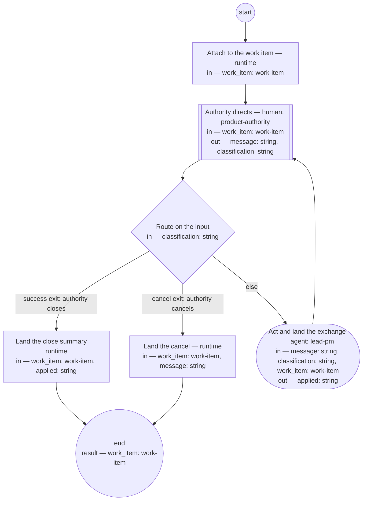

# Process: Work conversation

**Purpose:** Conduct a bounded operational discussion scoped to one work
item: every exchange lands on the item, so the discussion is containable,
findable, and survives the transcript.

**Guiding statement:** The work item carries the discussion; a
conversation that cannot name its work item does not start.

**Outcomes:**
- O1. Every applied exchange lands as a comment on the work item —
  witnessed by the check and `run` on `act`.
- O2. The conversation is scoped to exactly one work item, named at the
  start — witnessed by `parameters`.
- O3. Only the authority closes or cancels the conversation — witnessed
  by the `route` branches.
- O4. An inactive conversation holds instead of dangling — witnessed by
  `hold-after` and the run lifecycle.

**Roles:** product-authority (human-held role — directs, asks, and owns the
exclusive right to close or cancel). lead-pm — held by the
authority; its agent step assists: `act` performs the action inside the scope
the authority set, lands the exchange on the item, and files
out-of-scope work as its own item for the authority; the authority
directs and decides the item's scope.

**Scope note:** closing the conversation does not close the work item —
work may continue outside conversation. The close lands a summary
comment; the item's own life follows its own process.

## Flow (compiled)

Generated from the steps below by `tools/compile_process.py`; do not
edit by hand.




## Data

Each entry names a process-local value. Simple types use JSON Schema
names inline; every structured shape is a `$ref` to a defined type with
an explicit source.

```yaml
data:
  work_item: {$ref: work-item, from: pkg:beads/work-item}
  message: {type: string}
  classification: {type: string, enum: [instruction, question, close, cancel]}
  applied: {type: string}
```

## Steps

```yaml
start: attach
parameters: [work_item]
result: work_item
steps:
  - id: attach
    name: Attach to the work item
    run-by: {execution: runtime}
    inputs: [work_item]
    outputs: []
    run: |
      bd comment ${work_item.id} "Work conversation opened"
    next: observe

  - id: observe
    name: Authority directs
    run-by: {role: product-authority, execution: human}
    inputs: [work_item]
    outputs: [message, classification]
    prompt: |
      The work item and its history are in front of you. Your message is
      one of: an instruction to act on, a question, a close (a summary
      lands on the item; the item's own life continues), or a cancel.
      Silence holds the conversation after the declared window; the work
      item carries the resume point.
    next: route

  - id: route
    name: Route on the input
    run-by: {execution: runtime}
    inputs: [classification]
    branches:
      - label: "success exit: authority closes"
        when: classification == "close"
        next: close-out
      - label: "cancel exit: authority cancels"
        when: classification == "cancel"
        next: cancel-out
      - else: act

  - id: act
    name: Act and land the exchange
    run-by: {role: lead-pm, execution: agent}
    inputs: [message, classification, work_item]
    outputs: [applied]
    checks:
      - applied != ""
    prompt: |
      Act on the message within the work item's scope; answer questions
      from the item's history and the corpus. Land the exchange as a
      comment on the work item — what was asked, what was done, with
      links. Work that outgrows the item's scope is not absorbed: file it
      as its own item and say so. Nothing binding stays only in the
      transcript.
    next: observe

  - id: close-out
    name: Land the close summary
    run-by: {execution: runtime}
    inputs: [work_item, applied]
    run: |
      bd comment ${work_item.id} "Work conversation closed: ${applied}"
    next: end

  - id: cancel-out
    name: Land the cancel
    run-by: {execution: runtime}
    inputs: [work_item, message]
    run: |
      bd comment ${work_item.id} "Work conversation cancelled: ${message}"
    next: end
```

## Derived checks

| Outcome | Check | Kind | Where |
|---|---|---|---|
| O1 | `applied` non-empty; the exchange comment names it | mechanical + judged | `act.checks`, `act.prompt` |
| O2 | `work_item` is a run parameter — no item, no run | mechanical | `parameters` |
| O3 | close and cancel reachable only from the authority's input | mechanical | `route.branches` |
| O4 | inactivity holds the run | mechanical | `hold-after` + run lifecycle |

## Document History

| Version | Date | Kind | Entry |
|---|---|---|---|
| 1 | 2026-08-22 | update | Authored (seed layer); earlier history, if any, in the repository history. |
| 1 | 2026-08-22 | state | draft → approved. |
| 2 | 2026-08-23 | update | Owner direction: decision-ledger references removed — changes stand on their own; history entries and text no longer cite numbered decisions. |
| 3 | 2026-08-25 | update | Owner direction: a near-synonym of "role" retired and banned. |
| 4 | 2026-08-26 | update | Owner decision: lead-pm is held by the authority in person; the Roles header now names what the role's agent steps prepare and what the authority decides, per the lead-pm role's Interfaces. |
| 4 | 2026-08-26 | review | Assist re-basing screened: the header said the agent prepares an action the prompt has it perform — repaired in place to match the prompt. |
| 4 | 2026-09-02 | review | Skill rendering run (skill-rendering-process): the definition stands approved with no carried-by skill id, so no loadable skill renders at the agent’s load point — finding "missing work-conversation-process no-skill-id" escalated; the owner decides the amendment. |
| 5 | 2026-09-02 | update | Owner decision, resolving the skill-rendering first run's no-skill-id escalation: carried-by work-conversation-skill added, so the process renders to the agent's load point like every approved definition; the prose Carried-by paragraph left to the consistency pass (lead-dyz0o). |
