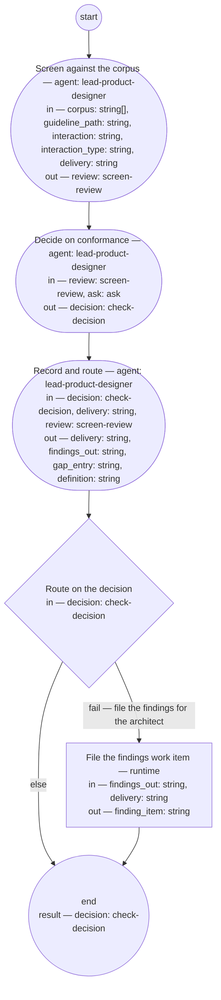

# Interaction conformance check (compiled from `interaction-conformance-check-process`)

Screen a delivered interaction — the recording a Bounded Context shop returns with its delivery — against the experience guidance corpus — the experience principles, the common and per-type guidelines, and the corpus records — so that the product designer role decides from a screen verdict whether it conforms, returns findings to the delivering shop, or changes the corpus; and so that a finding no corpus record can decide is recorded against the corpus, never against the delivery.

**The corpus applied, not the designer's taste. A rule the corpus cannot decide because its record is absent is the corpus's defect: the gap is filed against the corpus and the delivery is not held for it.**

Result of a run: `decision` (check-decision).



## screen — Screen against the corpus

Run by an agent in role `lead-product-designer` (fresh context every run). reads: corpus, guideline_path, interaction, interaction_type, delivery · writes: review.
- then: `decide`

Prompt:

```text
Read every path in corpus and the per-type guideline at
guideline_path, which is the guideline for interaction_type;
then the delivery and the recording at interaction — nothing
else. Judge the six
fitness scenarios. Report every finding with the rule or scenario
it fails by name, the quoted or described evidence, the change,
and whether you could decide it (confident) or not (wobbly); for
a wobbly finding describe the whole passage or behavior, since
the decision is made from the review alone. Where a rule needs a
corpus record that is absent, that lacks the entry, or whose
entry is marked hypothesis, report the finding with the rule as
its criterion and, as its change, "record absent:", "record
empty:", or "entry is a hypothesis:" with the record's name — a
finding against the corpus, never against the delivery.
Verdict "clean" only if there are no findings; otherwise
"findings" with the top three changes.
```

## decide — Decide on conformance

Run by an agent in role `lead-product-designer`. reads: review, ask · writes: decision.
- may ask: `lead-pm`, `lead-solutions-architect` — return an `ask` (with default and checkpoint) in place of outputs; at most one per run.
- then: `record`

Prompt:

```text
From the review, decide. "pass": no findings, or only corpus
findings (record absent, record empty, entry is a hypothesis) —
the delivery conforms to every rule the corpus can decide; name
each corpus finding and, for an absent record, the guideline
whose rule needs it, in the reasons so the gap is filed. "fail": a named rule or scenario is not met — name
it as the criterion; "fail" takes precedence where both stand.
"definition-change": a rule the corpus should carry and does not
— name the guideline and what it lacks as the gap. A question a corpus record
could carry is a corpus finding, never an ask. An ask is for a
decision no record will carry — whether the product should offer
the interaction at all (kind: reserved-decision, to lead-pm), whether a contract change a repair needs is admissible
(kind: contract, to lead-solutions-architect). Return it with
the question, its kind,
the default you will apply, and a checkpoint of the review; on
the first pass ask is absent, and if it carries an answer or
resolved defaulted, act on it. Decide from the review alone.
Record your reasons.
```

## record — Record and route

Run by an agent in role `lead-product-designer`. reads: decision, delivery, review · writes: delivery, findings_out, gap_entry, definition.
- then: `route-findings`

Prompt:

```text
Write into the delivery's Document History a review entry with
the screen verdict, then a state entry carrying the decision and
its reasons. Set the delivery's status: "conforms" on pass,
"returned" on fail, "pending-corpus" on definition-change. On
"fail", write the findings the shop can repair — each with its
rule, evidence, and change — as findings_out; otherwise return it
empty. On "definition-change", or on "pass" whose reasons name
corpus findings, write a review entry stating the gap into the
Document History of the guideline or record named — for an
absent record, of the guideline whose rule needs it; return that
file's path as definition and the entry's text as gap_entry;
otherwise return both empty. Return the delivery.
```

## route-findings — Route on the decision

Run by the runtime — no agent, no prose. reads: decision · writes: —.

```yaml
branches:
- label: "fail \u2014 file the findings for the architect"
  when: decision.verdict == "fail"
  next: file-findings
- else: end
```

## file-findings — File the findings work item

Run by the runtime — no agent, no prose. reads: findings_out, delivery · writes: finding_item.

```yaml
run: "bd create --type task --assign lead-solutions-architect \\\n  --title \"Interaction\
  \ conformance findings on ${delivery}\" \\\n  --body \"${findings_out}\" --link\
  \ ${delivery}\n"
next: end
```
