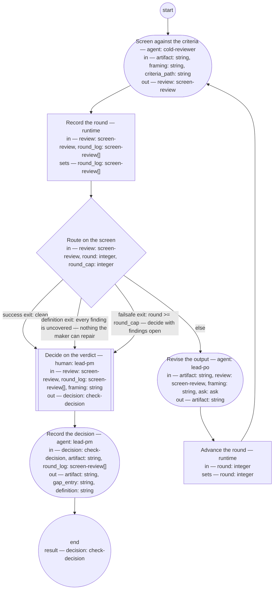

# Po output check (compiled from `po-output-check-process`)

Check a piece of the PO role's output against the PM role's framing under criteria the definitions state, so that the PM role decides from a screen verdict — pass, fail with the criterion named, or a definition change — and never by reading every artifact.

**The check is the criteria applied, not the checker's reading. A finding the criteria cannot name is a missing criterion, and the decision that follows is a definition change, not a verdict on the maker.**

Result of a run: `decision` (check-decision).



## screen — Screen against the criteria

Run by an agent in role `cold-reviewer` (fresh context every run). reads: artifact, framing, criteria_path · writes: review.
- then: `log-round`

Prompt:

```text
Read the criteria set at criteria_path, the framing at framing,
and the artifact at artifact — nothing else. Judge the artifact
against every criterion and against the framing: does each part
of it trace to the framing, and does anything in it serve no
framed outcome? Report every finding with the criterion it fails
by name — "framing" for a part that does not trace to the framing
or serves no framed outcome — the quoted text, the change, and
whether you could decide it (confident) or not (wobbly); for a
wobbly finding quote the whole passage, since the PM role decides
from the review alone. A defect no criterion names is a finding
with criterion "uncovered". Verdict "clean"
only if there are no findings; otherwise "findings" with the top
three changes.
```

## log-round — Record the round

Run by the runtime — no agent, no prose. reads: review, round_log · writes: round_log.

```yaml
set:
  round_log: round_log + [review]
next: route-screen
```

## route-screen — Route on the screen

Run by the runtime — no agent, no prose. reads: review, round, round_cap · writes: —.

```yaml
branches:
- label: 'success exit: clean'
  when: review.verdict == "clean"
  next: decide
- label: "definition exit: every finding is uncovered \u2014 nothing the maker can\
    \ repair"
  when: size(review.findings) > 0 && review.findings.all(f, f.criterion == "uncovered")
  next: decide
- label: "failsafe exit: round >= round_cap \u2014 decide with findings open"
  when: round >= round_cap
  next: decide
- else: revise
```

## revise — Revise the output

Run by an agent in role `lead-po`. reads: artifact, review, framing, ask · writes: artifact.
- may ask: `lead-pm` — return an `ask` (with default and checkpoint) in place of outputs; at most one per run.
- then: `advance-round`

Prompt:

```text
Repair every finding whose criterion is named, "framing"
included; leave findings marked "uncovered" as they are — they
are the PM role's to decide. If a repair needs something the framing does not say —
the originator's intent, whether a thing is in scope, a decision
another role's domain holds — return an ask to lead-pm instead
of guessing: the question, its kind, the default you will apply
if unanswered, and a checkpoint holding the repairs made so far.
On the first pass ask is absent; if it carries an answer or
resolved defaulted, act on it and finish the repairs.
```

## advance-round — Advance the round

Run by the runtime — no agent, no prose. reads: round · writes: round.

```yaml
set:
  round: round + 1
next: screen
```

## decide — Decide on the verdict

Run by a human holding role `lead-pm`. reads: review, round_log, framing · writes: decision.
- then: `record`

Prompt:

```text
From the final review and the round log, decide. "pass": the
screen is clean, or its only findings are uncovered and you judge
none of them needs a criterion — say so in the reasons. "fail": a
named criterion, "framing" included, is still missed at the round
cap — name it.
"definition-change": an uncovered finding should have been a
criterion, or a criterion the output met produced something that
does not serve the framing — name the definition and what it
lacks. Where both a missed named criterion and an open uncovered finding
stand at the cap, "fail" takes precedence and the reasons carry
the uncovered finding. Decide from the quotes in the review.
Record your reasons.
```

## record — Record the decision

Run by an agent in role `lead-pm`. reads: decision, artifact, round_log · writes: artifact, gap_entry, definition.
- then: `end`

Prompt:

```text
Write into the artifact's Document History one review entry per
round with its verdict, then a state entry carrying the decision
and its reasons. Set the artifact's status: "checked" on pass,
"returned" on fail with the criterion named, "pending-definition"
on definition-change. On "definition-change", write a review
entry stating the gap into the Document History of the definition
the decision names; return that file's path as definition and the
entry's text as gap_entry. Otherwise return both empty. Return
the artifact.
```
