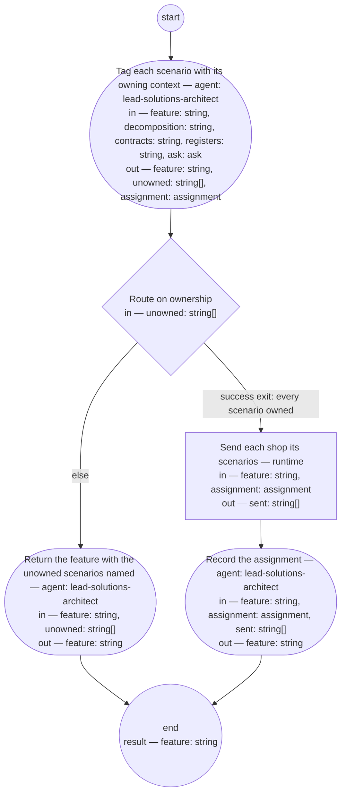

# Scenario assignment (compiled from `scenario-assignment-process`)

Turn a checked feature into work the Bounded Context shops can take up: the solutions architect role tags each scenario with the context that owns its behavior, reads each tagged context's pre-state to choose the message type its scenarios travel in, records the feature as assigned, and sends each shop its scenarios.

**The decomposition decides, not the wording. Which context owns a behavior is read from the decomposition and the contexts' contracts; a scenario no context can own is the architect's finding, not a guess.**

Result of a run: `feature` (string).



## assign — Tag each scenario with its owning context

Run by an agent in role `lead-solutions-architect`. reads: feature, decomposition, contracts, registers, ask · writes: feature, unowned, assignment.
- may ask: `lead-pm` — return an `ask` (with default and checkpoint) in place of outputs; at most one per run.
- then: `route`

Prompt:

```text
Read the decomposition and the feature. For each scenario, decide
which Bounded Context owns the behavior it states — from the
decomposition and that context's contract at contracts, never
from the scenario's wording alone — and write a single
@bounded-context:<name> tag on it. A scenario whose behavior no
context owns, that two contexts would each have to own, or whose
owning context differs from the shop named as its source in
Contributors, goes to unowned with the reason; do not guess. Then, for each context
tagged, read its pre-state — its contract at contracts and its view of
the register at registers, the full register where a scenario
could conflict — and choose the vehicle: assign_scenarios for net-new
behavior, request_bugfix for a scenario the register already
holds and the system fails, request_maintenance for a tightening
of held behavior. Write one assignment entry per context with
its vehicle, the @hash: values of its scenarios, and the
pre-state read. If deciding needs what the decomposition
cannot say — whether a behavior is meant to be in the product at
all — return an ask to lead-pm (kind: scope) with the question,
the default you will apply, and a checkpoint of the tags written
so far; on the first pass ask is absent, and if it carries an
answer or resolved defaulted, act on it. Return the tagged
feature.
```

## route — Route on ownership

Run by the runtime — no agent, no prose. reads: unowned · writes: —.

```yaml
branches:
- label: 'success exit: every scenario owned'
  when: size(unowned) == 0
  next: dispatch
- else: return
```

## return — Return the feature with the unowned scenarios named

Run by an agent in role `lead-solutions-architect`. reads: feature, unowned · writes: feature.
- then: `end`

Prompt:

```text
Write a review entry into the feature's Document History naming
each unowned scenario and its reason and set the feature's
status to "returned" — the returned feature is the handoff to
the PO role, which reads its status. The decomposition may need
a change, which this role raises as an architecture decision
record; the scenario may need a split, which is the PO role's;
or the scenario needs co-production with the newly named shop,
which the reason in unowned names.
```

## dispatch — Send each shop its scenarios

Run by the runtime — no agent, no prose. reads: feature, assignment · writes: sent.

```yaml
run: "set -- ${assignment.entries[].vehicle}\nfor ctx in ${assignment.entries[].context};\
  \ do\n  vehicle=$1; shift\n  shop-msg send --bc \"$ctx\" --type \"$vehicle\" \\\n\
  \    --feature \"${feature}\" --tag \"@bounded-context:$ctx\"\ndone\n"
next: record
```

## record — Record the assignment

Run by an agent in role `lead-solutions-architect`. reads: feature, assignment, sent · writes: feature.
- then: `end`

Prompt:

```text
Set the feature's status to "assigned" and write a state entry
into its Document History listing, from assignment, each
context's scenario hashes and vehicle, and, from sent (the tool's
standard output, one line per message — its output contract is
pinned when the messaging package is imported), the message sent to each. Return
the feature.
```
