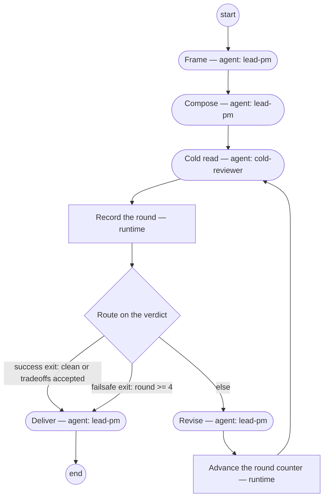

# Stakeholder presentation (compiled from `stakeholder-presentation-process`)

Turn source material into a presentation the product authority can decide from in one short sitting, verified by an independent cold read before delivery.



## frame — Frame

Run by agent in role `lead-pm`. reads: request · writes: frame.
- check: `size(frame.asks) <= 7`
- then: `compose`

Prompt:

```text
Read the request. Name the reader and every decision the
presentation must enable. Enumerate the asks; keep only the asks
that gate the next unit of work, and record the rest as deferrals —
a deferral is a note, never an ask. Group related asks and order
them by consequence. If the material holds more decisions than one
sitting can carry, split it by decision, not by topic, and frame
only the first split.
```

## compose — Compose

Run by agent in role `lead-pm`. reads: request, frame · writes: brief, annex.
- check: `words(brief.decision_layer) <= 400`
- check: `words(brief.decision_layer) + words(brief.support_layer) <= 1500`
- then: `cold-read`

Prompt:

```text
Write the decision and support layers fresh — never abridge the
source by deletion. Open with situation, complication, question,
answer in at most four sentences, then the recommendations and the
asks. Write each ask in four parts: question, recommendation,
inline evidence, default. State which asks gate work and which
resolve by default on silence; a block-ratification states what it
binds. Gloss every proper noun at first mention. Attach every block
to an ask or label it informational. Demote the original material
to a labeled annex and link it. Style rules:
guidelines/stakeholder-communication.md, layered on
guidelines/base-writing-style.md.
```

## cold-read — Cold read

Run by agent in role `cold-reviewer` (fresh context every run). reads: brief · writes: review.
- then: `log-round`

Prompt:

```text
Read the presentation alone; you have not seen the annex or any
earlier round, and that is the point. Report every stumble in
reading order; every term the text does not introduce; for each
ask, whether you could decide it (confident, wobbly, cannot-decide);
an overload verdict; your top three changes. Verdict "clean" only
if you found nothing. Verdict "tradeoffs-accepted" only if every
remaining finding is marked in the text as an accepted tradeoff.
Otherwise verdict "findings".
```

## log-round — Record the round

Run by the runtime — no agent, no prose. reads: review, round_log · writes: —.

```yaml
set:
  round_log: round_log + [review]
next: route-verdict
```

## route-verdict — Route on the verdict

Run by the runtime — no agent, no prose. reads: review, round · writes: —.

```yaml
branches:
- label: 'success exit: clean or tradeoffs accepted'
  when: review.verdict in ["clean", "tradeoffs-accepted"]
  next: deliver
- label: 'failsafe exit: round >= 4'
  when: round >= 4
  next: deliver
- else: revise
```

## revise — Revise

Run by agent in role `lead-pm`. reads: brief, review · writes: brief.
- then: `advance-round`

Prompt:

```text
Repair every finding in the review. Then run the consistency
sweep: counts and cross-references match, and every promise the
text makes holds against every line that follows it. Mark any
finding you will not repair as an accepted tradeoff, in the text,
with one sentence saying why.
```

## advance-round — Advance the round counter

Run by the runtime — no agent, no prose. reads: round · writes: —.

```yaml
set:
  round: round + 1
next: cold-read
```

## deliver — Deliver

Run by agent in role `lead-pm`. reads: brief, annex, review, round_log · writes: delivery.
- then: `end`

Prompt:

```text
Deliver the presentation to the reader with the annex linked. If
the final verdict is "findings" (the failsafe exit fired), state
the open findings before anything else. Attach the round log: one
line per round with the verdict and the judge's model and prompt
version.
```
