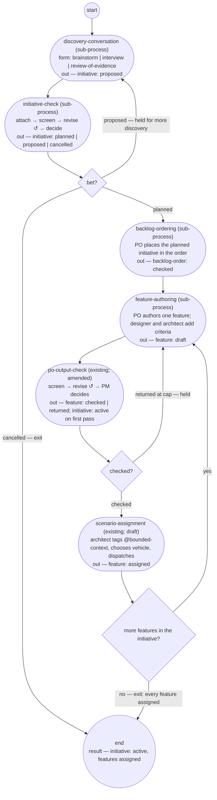

# Annex 032: the product flow, modeled end to end

Optional material for brief 032. The model is the plan's specification;
the definitions are built from it.

## The top-level process: `product-flow`

One run per initiative, from a discovery conversation to its features'
scenarios assigned. It composes sub-processes as steps
(`run-by: {execution: sub-process}`), so each sub-process is defined,
checked, and run on its own and the top level only sequences them and
carries the initiative between them.

Exits: the initiative cancelled at the bet; every feature assigned; and
a hold (`hold-after`) at any sub-process, as today. `completed` is set
later, by `reconcile-and-close`, outside this flow.

## The sub-processes

| # | Process | State | What changes | Roles |
|---|---|---|---|---|
| 1 | `discovery-conversation` | exists, approved | gains a `form` parameter (brainstorm first; interview; review of evidence), an `engage` step that also drafts the initiative's §1–3 from the conversation, and a `frame` step where the PM records the initiative as `proposed` (or `proposed` → `cancelled` when declined); output `initiative` instead of only the session record | authority (human), lead-pm's assisting agent |
| 2 | `initiative-check` | new | `attach` (architect: §4 feasibility, §5 decomposition; designer: §4 usability or "not yet" with an ask) → `screen` (cold-reviewer, fresh, against the initiative fitness set) → `route` → `revise` (lead-pm assist; asks to architect/designer) ↺ cap 3 → `decide` (human, authority: bet → `planned`; hold → stays `proposed`; cancel → `cancelled`, reason) → `record` (assist: status, the product decision record for the bet, Document History) | architect, designer, cold-reviewer, authority |
| 3 | `backlog-ordering` | new, small | `place` (lead-po: the planned initiative's features-to-be into the backlog order against the PM's priority; enablers placed or declined) → `po-output-check` on the order (sub-process) | lead-po, then the check |
| 4 | `feature-authoring` | new | `draft` (lead-po, sole author: Feature narrative from the initiative's §1–2; scenarios with `@feature:`/`@hash:`; owning shops named from the decomposition) → `criteria` (designer: usability and accessibility where §2 names a type; architect: non-functional constraints where the decomposition names them) → `po-output-check` (sub-process). No co-produce step: conflicts with held behavior are caught by the register sweep at assignment; the shop's voice after dispatch is the clarify and the return. | lead-po, designer, architect |
| 5 | `po-output-check` | exists, approved | amended: reads the initiative (the framing is its §1); on the first feature's pass, sets the initiative `active`; criteria sets now exist for feature, decision record, order | as today |
| 6 | `scenario-assignment` | exists, draft | as defined; approve | architect |

Two things the flow needs that are not processes: the `router` role
(reconcile-and-close names it) — not in this flow, deferred; and the
`initiative-check` process's authority step is a human step, so a
`review-conversation` run is not needed for the bet — the bet is taken
inside the check, which removes one of the four pending amendments the
initiative typedef lists.

## Build order and effort

Ordered so that each step yields a runnable increment and the whole
can be screened as one set.

| Step | Work | New definitions | Amendments | Screen |
|---|---|---|---|---|
| A | `initiative-check` | 1 process (+ skill) | initiative typedef: the pending-process names resolved | one screen: the process against the process chain |
| B | `discovery-conversation` amendment | — | 1 process: form parameter, initiative output, cancel path | same screen as A (the two are one hand-off) |
| C | `feature-authoring` + `backlog-ordering` | 2 processes (+ skills) | lead-po: the processes named | one screen for both |
| D | `po-output-check` amendment; `scenario-assignment` approval | — | 1 process: initiative input, `active` write | one screen |
| E | `product-flow` top level | 1 process (+ skill) | primer: the flow named as the shop's operating process; its first paragraph | one screen of the whole set, end to end, tracing one initiative |

Five definition batches; four screens; approvals as blocks — one per
batch. Estimate: each batch is one session at the pace of the last
three days (a batch of two or three definitions with two or three screen
rounds); five sessions, then Phase 2's first feature runs through it.

## What is deliberately left out

- `initiative` `completed` — `reconcile-and-close`'s amendment, after
  assignment; not in this flow.
- The changelog and roadmap renderings; the cross-context count.
- The `router` role and the reconcile side generally.
- User research as a discovery form beyond the three named.
- Shop co-authorship of scenarios: dropped by owner decision — the
  register sweep and post-dispatch clarifies replace it.
