# Slice 1 · Target B — the Implementer→Reviewer loop + gated `work_done`, as a fabro workflow

**Epic:** lead-6k1r (Fabro spike) · **Slice:** 1 (design-only, artifact surface) ·
**Branch:** `fabro-spike` · **Date:** 2026-07-01 · **Leg:** B

This leg specifies **TARGET B**: the minimal bc-shop Implementer→Reviewer loop and
its gated `work_done` emission, expressed as a **fabro DOT workflow** (`workflow.fabro`
+ `workflow.toml`). It is the drop-in loop a fabro-orchestrated BC must run so that a
lead `assign_scenarios` dispatch produces a valid `work_done` per the shop-msg
protocol — with the launch half specified separately in Target A (`01a-*`).

Grounding (facts taken as given, not re-derived): `00-fabro-recon.md`,
`00a-fabro-tool.md` (fabro tool / DOT format / vault seam), `00b-f6ta-seams.md`
(2 seams / 4 invariant surfaces), `00c-bcshop-loop.md` (the loop, the `work_done`
shape, the furniture). Citations below point at those legs and at the ADR/PDR/skill
sources they in turn cite.

---

## 0. Hard invariants this spec obeys

From `plan.md` §"Hard constraints" and `00b`:

1. **Fabro = in-container BC orchestration ONLY.** The graph below runs inside an
   ephemeral *local* fabro server (`[environments.local] provider='local'`) inside the
   BC container. Nothing here orchestrates the lead. (`00a` §5; `plan.md` §1.)
2. **Credentials via agent-vault, NOT fabro secrets.** No node reads a real secret
   from fabro's vault; agent/command nodes inherit `HTTPS_PROXY→agent-vault` and the
   proxy injects real creds on-wire. Fabro's `vaults/default/secrets.json` holds only
   dummy placeholders. (`00a` §4.3; `plan.md` §2; PDR-017.)
3. **Launch-interface parity** is Target A's concern; this leg assumes the container is
   already up with skills poured and the tmux/agent surface engaged.
4. **shop-msg protocol preserved.** The loop consumes the inbox and emits
   `work_done`/`clarify` *only* through `shop-msg`/`bc-emit` (pydantic-validated,
   never hand-written). (`00c` §1.7–1.8.)
5. **The four f6ta invariant surfaces hold at the BC tier** (`00b`): bd is
   authoritative (fabro SlateDB checkpoint demoted to resume-only); name-registry
   addressing untouched; ADR-018 harvest surface preserved (lead reads outbox, never
   fabro outputs); credentials via agent-vault.

---

## 1. Node taxonomy — how the loop's node kinds map onto fabro DOT

Fabro's documented node vocabulary (`00a` §3.3): `shape=Mdiamond`=Start,
`shape=Msquare`=Exit, `shape=hexagon`=human-approval gate, a node carrying
`prompt="…"`=an **LLM-agent node** (multi-turn, tool-using), `class="…"` routes the
node to a model via the graph's `model_stylesheet` attr, and **edges carry outcome
labels**. This leg uses three node kinds:

| Kind | fabro encoding | Used for |
|---|---|---|
| **LLM-agent node** | `prompt="…"`, `class="coding"|"review"` | judgment roles: router classify, `bc-sufficiency-check`, `writing-plans-bdd`, `bc-implementer`, `bc-reviewer`/`bc-review`. These load ported skill furniture as their prompt body. |
| **COMMAND node** | `shape=box`, deterministic `cmd="…"` (a tool-restricted exec node — Bash-only, no LLM judgment) | running `shop-msg`, `bc-emit`, `scenarios hash`, `git worktree`, the RED-before-GREEN inter-layer check, `integrating-to-main`, and the 3-check `work-done-gate`. |
| **Terminal** | `shape=Mdiamond`/`shape=Msquare` | Start; and three distinct Exits (§4). |

> **Open item flagged, not assumed:** `00a` confirms the *agent* node (`prompt=`) and
> the Start/Exit/hexagon shapes empirically, and `00b` uses the phrase "command node"
> for `shop-msg watch`, but the exact fabro attribute for a **non-LLM command/exec
> node** (a native `cmd=`/`run=` primitive vs. a tool-restricted agent node whose
> prompt is "run exactly this command and report its exit outcome") was **not** pinned
> in Slice 0. Slice 2 must confirm the concrete attribute. This spec writes command
> nodes as `shape=box` with a `cmd=` annotation and treats their outcome as the
> command's exit status (`ok`/`failed`); if fabro has no native command node, each
> `cmd=` box is realized as a deterministic tool-restricted agent node. Either way the
> **graph shape, the outcome-conditional edges, and the furniture mapping are
> unchanged** — only the node-attribute spelling differs.

---

## 2. The workflow — `workflow.fabro` (DOT)

```dot
digraph BcShopLoop {
    graph [
        goal="Recreate the bc-shop Implementer->Reviewer loop and emit a GATED work_done via shop-msg. HARD RULE: a FAILED node must never advance to Exit:SUCCEEDED — every fallible node carries an explicit outcome-labeled failure edge."
        // model routing is fabro's; the provider KEY rides agent-vault (dummy ANTHROPIC_API_KEY in vault + HTTPS_PROXY), never a real fabro secret (00a s4.3).
        model_stylesheet="* { model: claude-haiku-4-5 } .coding { model: claude-sonnet-4-5 } .review { model: claude-sonnet-4-5 }"
        rankdir=TB
    ]

    // ---------- terminals (three DISTINCT exits; see s4) ----------
    start    [shape=Mdiamond, label="Start"]
    done     [shape=Msquare,  label="Exit: SUCCEEDED\n(work_done complete emitted, or idle-empty)"]
    reported [shape=Msquare,  label="Exit: REPORTED\n(clarify OR work_done blocked emitted via shop-msg)"]
    halt     [shape=Msquare,  class="fail", label="Exit: HALTED / FAILED\n(session-start infra failure; NO role work emitted)"]

    // ---------- session start (command nodes) ----------
    prime    [shape=box, label="prime",
              cmd="shop-msg prime --bc <name> ; bd prime"]                     // 00c s1.1 (2,3)
    health   [shape=box, label="work-tracker health gate",
              cmd="bd create->id under prefix ; bd ready ; TEST dolt push"]     // 00c s1.1 (4) — GATES the role loop
    arm      [shape=box, label="arm shop-msg watch (Monitor) + drain inbox",
              cmd="shop-msg watch --bc <name> (LISTEN/NOTIFY) ; shop-msg pending inbox --bc <name> ; shop-msg read inbox --work-id <id>"] // 00c s1.1 (5,6); Seam(b) survives as a command node (00b)

    // ---------- classify (agent) ----------
    classify [class="coding", label="bc-router classify",
              prompt="bc-router: classify message_type via the 4-row table (00c s1.2). assign_scenarios | non-empty request_bugfix -> scenario path (reviewer emits). request_maintenance | empty request_bugfix -> flat path (implementer emits)."]

    // ---------- scenario path (reviewer is SOLE work_done emitter) ----------
    suff     [class="coding", label="bc-sufficiency-check",
              prompt="Binary proceed|clarify per per-message-type criteria (00c s1.3 step2 / s1.5). Insufficient -> clarify naming the gap; do NOT dispatch."]
    worktree [shape=box, label="using-git-worktrees",
              cmd="git worktree add branch named for <work_id> BEFORE any impl"] // 00c s1.3 step3
    plan     [class="coding", label="writing-plans-bdd",
              prompt="Decompose assigned scenario(s) into a bd sub-issue DAG: one RED + one GREEN sub-issue per behavior, bd dep edges encoding order."] // 00c s1.3 step4
    impl     [class="coding", label="bc-implementer (parallel fan-out)", parallel=true,
              prompt="subagent-driven-development: bd ready -> dispatch all unblocked sub-issues in PARALLEL to bc-implementer; each runs test-driven-development RED->GREEN->REFACTOR; recompute @scenario_hash via 'scenarios hash' (block-only, ADR-019) == on-disk tag."] // 00c s1.3 step5, s1.4
    redgate  [shape=box, label="RED-before-GREEN inter-layer gate",
              cmd="verify each sub-issue closed AND test(red) committed & watched-fail PRECEDES feat(green) in work-branch history"] // 00c s1.3 step5 (inter-layer gate)
    integ    [shape=box, label="integrating-to-main",
              cmd="land the work branch on origin/main"]                        // 00c s1.3 step6
    review   [class="review", label="bc-reviewer / bc-review",
              prompt="Adversarial gate: re-run BDD suite; probe faithful realization; probe step defs (broad regex / swallowed exceptions / state leakage); verify test(red) precedes feat(green). Outcome: signoff | scenario_gap | impl_gap."] // 00c s1.5
    wdg_r    [shape=box, label="work-done-gate (3 checks)",
              cmd="C1 clean tree over features/,src/,tests/ (git status --porcelain -uall, carve-outs discounted) | C2 work_id reachable from origin/main as WHOLE token (git log origin/main -E --grep='\\b<work_id>\\b') | C3 scenario_hashes SUBSET of committed @scenario_hash tags (scenarios hash recompute + git grep)"] // 00c s1.6
    emit_r   [shape=box, label="reviewer emits work_done — SOLE EMITTER",
              cmd="bc-emit work-done --bc <name> --work-id <id> --scenario-hash <h..> --summary '<probes considered+dismissed>' (wrapper re-runs gate; status=complete)"] // 00c s1.5, s1.7

    // ---------- flat path (implementer is the emitter; no reviewer) ----------
    impl_f   [class="coding", label="bc-implementer (maintenance / empty bugfix)",
              prompt="No planning, no reviewer. Make the flat change; then run work-done-gate as the emitter (00c s1.3 tail, s1.4)."]
    wdg_f    [shape=box, label="work-done-gate (3 checks)",
              cmd="same C1|C2|C3 as wdg_r (00c s1.6)"]
    emit_f   [shape=box, label="implementer emits work_done",
              cmd="bc-emit work-done ... --status complete (implementer is emitter on flat path)"] // 00c s1.2 table, s1.4

    // ---------- shared report emitters (command nodes) ----------
    emit_clar [shape=box, label="emit clarify",
               cmd="shop-msg respond clarify --bc <name> --work-id <id> --question '<gap>'"] // 00c s1.5
    emit_blk  [shape=box, label="emit work_done BLOCKED (named evidence)",
               cmd="shop-msg respond work_done --bc <name> --work-id <id> --status blocked --summary '<failed check + evidence>'"] // 00c s1.5, s1.6 (any gate fail -> blocked)

    // =======================================================================
    // EDGES — every fallible node has an EXPLICIT outcome-labeled failure edge.
    // There is NO unlabeled fall-through from a fallible node to `done`.
    // This is the fix for the Slice-0 silent-failure-masking hazard: fabro's
    // DEFAULT unconditional edge would advance past a FAILED node and mark the
    // run SUCCEEDED (00-recon d; 00b "sharpest risk"). Outcome-conditional edges
    // forbid that. Command nodes may ALSO carry retries=N (see workflow.toml).
    // =======================================================================

    start -> prime

    prime  -> health [label="ok"]
    prime  -> halt   [label="failed"]        // DSN unreachable at prime -> HALT, no work emitted

    health -> arm    [label="healthy"]
    health -> halt   [label="unhealthy"]     // 00c s1.1 block path: role loop does NOT begin, emits NO role work

    arm    -> classify [label="message"]
    arm    -> done     [label="empty"]        // nothing pending: legitimate idle-empty SUCCEEDED

    classify -> suff   [label="scenario"]      // assign_scenarios | non-empty request_bugfix
    classify -> impl_f [label="flat"]          // request_maintenance | empty request_bugfix

    // --- scenario path ---
    suff -> worktree  [label="proceed"]
    suff -> emit_clar [label="clarify"]        // insufficient -> clarify, STOP (00c s1.3 step2)

    worktree -> plan  [label="ok"]
    worktree -> emit_blk [label="failed"]

    plan -> impl      [label="ok"]
    plan -> emit_blk  [label="failed"]

    impl -> redgate   [label="ok"]
    impl -> emit_blk  [label="failed"]

    redgate -> integ  [label="pass"]
    redgate -> emit_blk [label="fail"]         // RED not before GREEN -> BLOCK; must NOT proceed to integrate

    integ -> review   [label="ok"]
    integ -> emit_blk [label="failed"]

    review -> wdg_r   [label="signoff"]
    review -> emit_clar [label="scenario_gap"] // 00c s1.5: gap in scenario -> clarify to lead
    review -> emit_blk  [label="impl_gap"]      // 00c s1.5: implementation gap -> work_done blocked

    wdg_r -> emit_r   [label="pass"]
    wdg_r -> emit_blk [label="fail"]           // any of C1/C2/C3 fails -> BLOCKED, never complete

    emit_r -> done    [label="ok"]
    emit_r -> halt    [label="failed"]         // UNIQUE(work_id,direction,shop) collision / retry-exhausted: HALT, NOT silent success (ADR-012 backstop)

    // --- flat path ---
    impl_f -> wdg_f    [label="ok"]
    impl_f -> emit_clar [label="clarify"]      // failed sufficiency on flat path emits clarify directly (00c s1.4)
    impl_f -> emit_blk [label="failed"]

    wdg_f -> emit_f    [label="pass"]
    wdg_f -> emit_blk  [label="fail"]

    emit_f -> done     [label="ok"]
    emit_f -> halt     [label="failed"]

    // --- report emitters converge on REPORTED (a correct terminal) ---
    emit_clar -> reported [label="ok"]
    emit_clar -> halt     [label="failed"]
    emit_blk  -> reported [label="ok"]
    emit_blk  -> halt     [label="failed"]
}
```



### `workflow.toml` (execution env + node retry)

```toml
_version = 1
[workflow]
graph = "workflow.fabro"

[run.environment]
id = "local"                       # ephemeral in-container fabro server (00a s5)
[environments.local]
provider = "local"                 # inherits parent env => HTTPS_PROXY reaches agent-vault (00a s4.3, OQ1)

# Node retry belt-and-suspenders for the ADR-012 vs checkpoint micro-window (00b sharpest risk).
# Emit nodes are IDEMPOTENT only because ADR-012 UNIQUE(work_id,direction,shop) rejects a
# double-deposit; retries here are safe ONLY with that backstop + the bd-first sweeper present.
[run.retry]
default_max_attempts = 1
[run.retry.nodes]
prime = 3
health = 2
integ = 2
emit_r = 2                         # relies on UNIQUE backstop; a 2nd attempt after a phantom row must fail-closed to `halt`
emit_f = 2
emit_blk = 2
emit_clar = 2
```

> **`project.toml [run.pull_request]` caution.** `integrating-to-main` lands on
> `origin/main` via the loop's own `git`/`shop` discipline. If fabro's native
> `[run.pull_request]` (`00a` §3.3) is left enabled it becomes a **second integration
> authority** competing with `integrating-to-main` and could open PRs the loop does
> not expect — disable it for this workflow (`enabled = false`) so integration stays
> single-authority (parallels the bd-authority invariant, `00b` Invariant 1).

---

## 3. Where and how `work_done` is emitted

**Wire shape** (`catalog.schemas.WorkDone`, `00c` §1.7):

```python
class WorkDone(BaseModel):
    message_type: Literal["work_done"]
    work_id: str
    status: Literal["complete", "partial", "blocked"]
    summary: str | None = None
    scenario_hashes: list[str] = Field(default_factory=list)
```

The message is **built and validated by the CLI/pydantic; never hand-written YAML**
(`00c` §1.7). Three graph nodes emit a `BCResponse`, and exactly one path reaches each:

| Node | Emits | Command | Who / when |
|---|---|---|---|
| `emit_r` | `work_done status=complete` | `bc-emit work-done …` (wrapper re-runs the gate) | **Reviewer — SOLE emitter for scenario work.** Reached ONLY via `review→signoff→wdg_r→pass`. (`00c` §1.5.) |
| `emit_f` | `work_done status=complete` | `bc-emit work-done …` | **Implementer** on the flat path (`request_maintenance` / empty `request_bugfix`). (`00c` §1.2 table.) |
| `emit_blk` | `work_done status=blocked` | `shop-msg respond work_done --status blocked --summary <evidence>` | Any deliverable-side gate/step failure. **A failed node's evidence, never a silent complete.** (`00c` §1.5–1.6.) |
| `emit_clar` | `clarify` | `shop-msg respond clarify --question …` | Insufficient intake or reviewer scenario-gap. (`00c` §1.5.) |

**The gate `emit_r`/`emit_f` sit behind (`work-done-gate`, `00c` §1.6) — all three
must pass before `status=complete`:**

1. **Clean deliverable tree** — `git status --porcelain -uall` over `features/`,
   `src/`, `tests/`; carve-outs (`.beads/issues.jsonl`, `.specstory`,
   `.claude/settings.json`, …) discounted by the `bc-emit` wrapper's `_CARVE_OUTS`.
2. **`work_id` reachable from `origin/main` as a WHOLE token** —
   `git fetch origin && git log origin/main -E --grep="\b<work_id>\b"`; a strict
   prefix (`lead-8v` of `lead-8vwf`) does NOT match.
3. **Scenario-hash subset (ADR-010)** — `work_done.scenario_hashes` ⊆ the
   `@scenario_hash:` tags committed under `features/`, recomputed via `scenarios hash`
   (block-only canonicalization, ADR-019 — `Feature:` line not hashed) and confirmed
   present with `git grep`. May report fewer, never a hash absent from `features/`.

Any check failing routes `wdg_*→emit_blk` (`--status blocked` with named evidence) —
the block-conversion semantics, expressed as an **edge**, not an in-node branch.

---

## 4. The silent-failure-masking fix — outcome-conditional edges (CRITICAL)

Slice 0 recorded the sharpest new hazard: **fabro's default *unconditional* edge
advances past a FAILED node and marks the run SUCCEEDED** (`00-recon.md` §d; `00b`
"sharpest risk"; `findings/fabro-2pc-as-steps-spike.md`). This spec eliminates it
structurally:

- **Every fallible node carries an explicit outcome-labeled edge for its failure
  outcome** (`[label="failed"]`, `[label="fail"]`, `[label="unhealthy"]`,
  `[label="impl_gap"]`, …). These are drawn explicitly in §2.
- **No fallible node has an unlabeled fall-through edge to `done`.** `done`
  (Exit: SUCCEEDED) is reachable ONLY from `emit_r ok`, `emit_f ok`, or the
  legitimate `arm→empty` idle case.
- **Three distinct terminals** encode the three legitimate ends and keep "failed" out
  of "succeeded":
  - `done` — SUCCEEDED: a validated `work_done complete` was emitted, or the inbox was
    empty (idle).
  - `reported` — REPORTED: a `clarify` or `work_done blocked` was emitted via
    shop-msg. This is a *correct* terminal (the loop did its job of reporting), NOT a
    masked failure.
  - `halt` — HALTED/FAILED (`class="fail"`): a session-start infra failure
    (`prime`/`health`) where **no role work is emitted** (`00c` §1.1 block path), or an
    emit node that could not deposit even after retry (UNIQUE collision). The run
    status is FAILED — the failure is surfaced, never laundered into SUCCEEDED.
- **`fabro validate`/`preflight`** (`00a` §5) statically checks the graph; a review
  step for this workflow must assert **no fallible node → `done`** and **every agent/
  command node has a failure edge** before it is allowed to run.
- **Belt-and-suspenders at the emit boundary:** node `retries` (`workflow.toml`) plus
  the ADR-012 `UNIQUE(work_id,direction,shop)` backstop and the bd-first sweeper
  (which **remain mandatory** — the in-node micro-window kill is not eliminated,
  `00b`) guard the checkpoint-vs-`shop-msg respond` race at the emit nodes.

---

## 5. Furniture to port into fabro's format to make each node real

Each agent/command node above is only a shell until the corresponding
`shop-templates` furniture (`00c` §3) is translated into fabro's format (skill prose
inlined into `prompt=`, or invoked via fabro's skill primitive; subagent fan-out via
fabro `parallel` nodes). Port list, node-by-node:

| Furniture (source) | Kind | Realizes node(s) |
|---|---|---|
| `bc-router/SKILL.md` (classification table, session-start protocol, flowchart) | skill → the graph itself + `classify` | `prime`, `health`, `arm`, `classify` |
| `bc-sufficiency-check/SKILL.md` | skill → agent prompt | `suff` |
| `writing-plans-bdd/SKILL.md` | skill → agent prompt | `plan` |
| `subagent-driven-development/SKILL.md` | skill → parallel fan-out semantics | `impl` (`parallel=true`) + the `redgate` inter-layer gate |
| `test-driven-development/SKILL.md` (+ `testing-anti-patterns.md`) | skill → agent prompt (RED→GREEN→REFACTOR, `test(red)`/`feat(green)` commits) | inside `impl`; asserted by `redgate` |
| `using-git-worktrees/SKILL.md` | skill → command | `worktree` |
| `integrating-to-main/SKILL.md` | skill → command | `integ` |
| `bc-review/SKILL.md` | skill → agent prompt | `review` |
| `work-done-gate/SKILL.md` (3 checks + block-conversion) | skill → command | `wdg_r`, `wdg_f`; block edge → `emit_blk` |
| `bc-implementer.md` (role shim) | subagent template → `class="coding"` agent | `impl`, `impl_f` |
| `bc-reviewer.md` (role shim) | subagent template → `class="review"` agent | `review` |

Two support pieces also cross over (`00c` §3.3–3.4): `claude_settings/bc.json`
SessionStart hooks (`bd prime`, `shop-msg prime`) → the `prime`/`health` command
nodes; and the emit path depends on the `bc-emit work-done` wrapper + `shop-msg` +
`scenarios hash` CLIs being on PATH inside the fabro sandbox (baked into the
fabro-launcher image per Target A). **`scenarios hash` must be present** — its absence
is exactly the ADR-022 bc-base gap (`00-recon.md` §d).

**Not ported (invariant surfaces — stay outside fabro):** the `shop-msg watch`
LISTEN/NOTIFY event source (Seam(b) is PARTIAL — fabro wraps the loop but cannot BE
the event source, so `shop-msg watch` stays a command node, `00b`); bd as the state
authority (fabro SlateDB demoted to resume-only); the lead-side harvest
(`shop-msg read outbox` + `scenarios hash`, ADR-018); real credentials (agent-vault).

---

## 6. ACCEPTANCE CRITERIA for Slice 4 (`assign_scenarios` → valid `work_done`)

Slice 4 is green when a lead `assign_scenarios` dispatch to a **throwaway minimal BC**
orchestrated by an in-container fabro server running this workflow produces a valid
`work_done`, verified **only** on the artifact/mailbox surface:

1. **Dispatch.** Lead sends `assign_scenarios` (with well-formed scenario(s) carrying
   `@scenario_hash:` tags) via `shop-msg send` to the fabro-orchestrated BC.
2. **Path taken.** The in-container fabro run traverses
   `arm→classify(scenario)→suff(proceed)→worktree→plan→impl→redgate(pass)→integ→review(signoff)→wdg_r(pass)→emit_r→done` — observable as fabro `events`/`logs`
   (for the spike operator only; NOT as the lead's harvest surface).
3. **RED-before-GREEN held.** `redgate` passed: for each behavior, a
   `test(red)` commit that was watched to fail precedes its `feat(green)` in the
   work-branch history (`00c` §1.3/§1.4).
4. **Reviewer is the SOLE emitter.** The `work_done complete` was emitted by `emit_r`
   (`bc-emit work-done`), reached only via reviewer sign-off — not by the implementer,
   not hand-written. (`00c` §1.5.)
5. **Valid `work_done` on the wire.** `shop-msg read outbox --bc <name> --work-id
   <id>` returns a `catalog.schemas.WorkDone` with `message_type="work_done"`,
   `work_id` == the assigned id, `status="complete"`, a **substantive** `summary`
   (not `test`/`tbd`/`wip`/empty), and `scenario_hashes` a **subset** of the committed
   `@scenario_hash:` tags.
6. **The three gate checks verifiably held:** deliverable tree clean; `work_id`
   reachable from `origin/main` as a whole token; every echoed hash recomputes equal
   via `scenarios hash` (block-only, ADR-019) and is present under `features/`.
7. **Lead harvests via the invariant surface only** — `shop-msg read outbox` +
   `scenarios hash`, **never** by reading fabro run outputs (ADR-018; `00b` Invariant 3).
8. **Silent-failure guard proven, not just present:** inject one failure (e.g. force
   `redgate` to fail, or dirty a deliverable path before `wdg_r`) and confirm the run
   reaches `reported` with a `work_done status=blocked` carrying named evidence — and
   does **NOT** reach `done`/SUCCEEDED. (Direct exercise of the `00-recon` §d hazard.)
9. **Credentials rode agent-vault, not fabro secrets:** fabro's
   `vaults/default/secrets.json` held only dummy placeholders; agent/command nodes
   inherited `HTTPS_PROXY→agent-vault`; the model/provider key never lived in fabro as
   a real value. (`00a` §4.3; `plan.md` §2.) — This requires the **non-dry-run**
   agent-node confirmation deferred from Slice 0 (`00a` OQ1/OQ4).
10. **bd stayed authoritative; no phantom row.** After the emit, the postgres outbox
    holds exactly one `work_done` row for the `work_id`; the ADR-012
    `UNIQUE(work_id,direction,shop)` constraint + bd-first sweeper are present; a
    between-node kill/resume replays without re-depositing. (`00b` sharpest risk;
    `findings/fabro-2pc-as-steps-spike.md`.)

Criteria 8–10 are the ones Slice 0 explicitly deferred to Slices 3–4 (`00-recon.md`
§e); this spec pins them as pass/fail gates.

---

## 7. Open questions carried forward (blockers/unknowns for Slices 2–4)

1. **Command-node attribute (§1).** Does fabro expose a native non-LLM command/exec
   node, or must each `cmd=` box be a tool-restricted (Bash-only, deterministic)
   agent node? Confirm in Slice 2 with `fabro validate` on this graph.
2. **`HTTPS_PROXY` propagation into node exec env** (`00a` OQ1) — proven for fabro's
   own GitHub ops; NOT yet proven for an *agent node's own* tool/LLM calls under a
   non-`local` sandbox. Verify with a non-dry-run agent node before Slice 4.
3. **External-async wake** (`00b` Seam(b)) — a fabro node can *poll* `shop-msg pending`
   but the block-and-wait on postgres LISTEN/NOTIFY is unconfirmed; the `arm` node
   models a drain, not a live block-wait. Confirm whether the in-container-only scope
   fully dissolves Seam(b) or leaves a poll loop.
4. **Multi-emit-per-node** (`00-recon` §d) — can one node emit multiple `shop-msg`
   messages (e.g. `work_done` + `mechanism_observation`) when only final JSON is
   validated? The graph currently keeps emissions on distinct nodes to sidestep this.
5. **Standing blocker:** `bc-base` is un-rebuildable (ADR-022 — `scenarios` CLI not
   baked; pdr/002 pin 404s). No live boot in Slice 1; must resolve before Slice 4's
   real container run — and the `scenarios hash` dependency in §5 makes this a hard
   Slice-4 prerequisite.

---

## Sources

- `findings/fabro-spike/00-fabro-recon.md` (§a tool, §b seams, §c loop/launch, §d
  risks incl. silent-failure hazard, §e Slice-1 recommendation).
- `findings/fabro-spike/00a-fabro-tool.md` (§3.3 DOT node vocab; §4 secret seam + §4.3
  agent-vault bypass; §5 `provider='local'`; open questions).
- `findings/fabro-spike/00b-f6ta-seams.md` (2 seams / invariant surfaces; Seam(b)
  PARTIAL; sharpest ADR-012-vs-checkpoint risk; 4th agent-vault invariant).
- `findings/fabro-spike/00c-bcshop-loop.md` (§1.1 session start; §1.2 classification;
  §1.3 pipeline; §1.4 implementer; §1.5 reviewer/sole-emitter; §1.6 three gate checks;
  §1.7 `WorkDone` shape; §3 furniture inventory).
- `findings/fabro-spike/plan.md` (goal = Slice 4 green; hard constraints §1–5).
- `findings/fabro-2pc-as-steps-spike.md` (between-node safe / in-node micro-window not
  eliminated → UNIQUE + bd-first sweeper mandatory; outcome-conditional edges needed).
- ADR-010 (scenario-hash), ADR-012 (2PC/UNIQUE), ADR-016 (bd integration), ADR-018
  (empirical harvest surface), ADR-019 (block-only hash), ADR-022 (bc-base gap);
  PDR-010 (bd authority), PDR-017 (agent-vault).
