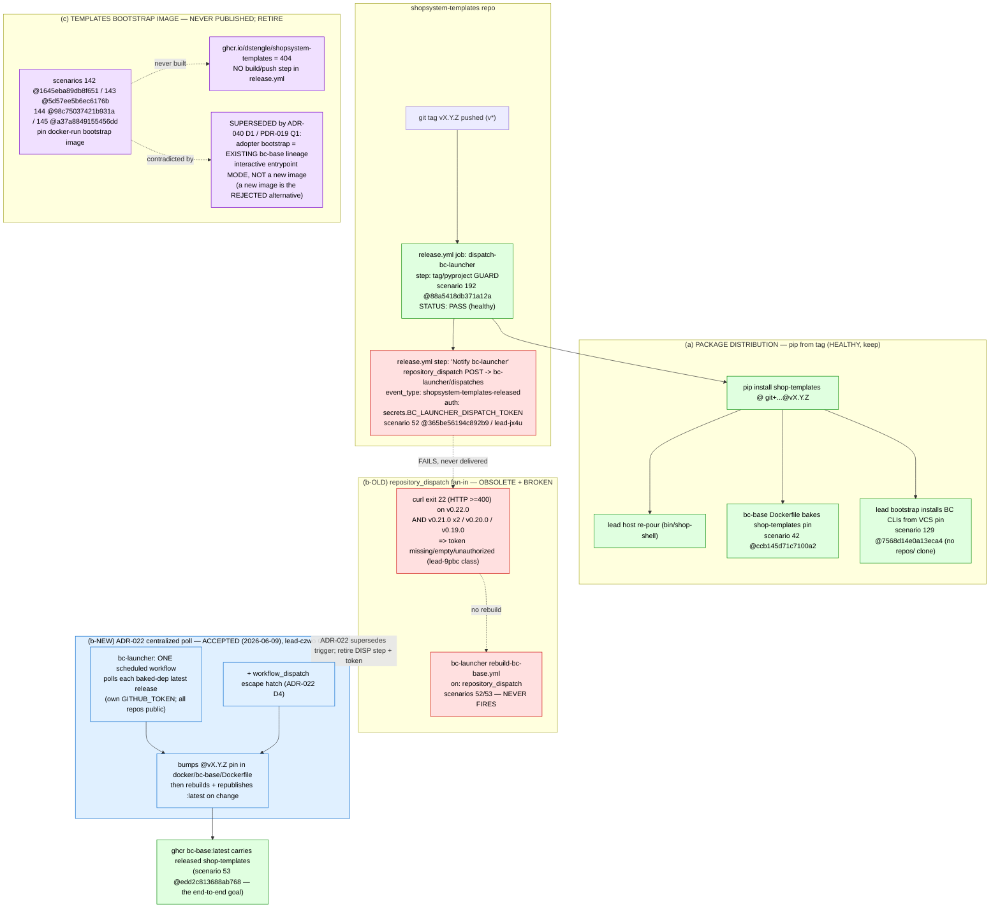

# shopsystem-templates publishing / release flow — analysis + diagram

**Author:** lead-architect (Claude) · **Date:** 2026-06-23
**Beads:** `lead-fuh4`, `lead-u8ip`, cross-linked to `lead-czwo`
**Evidence rule:** ADR-018 / PDR-011 — contract/artifact surface only (this repo's
`features/`, `adr/`, `pdr/`; scenario hashes via the installed `scenarios` CLI;
ghcr/GitHub artifact surface via the proxy-injected `gh api`; `shopsystem-templates`
`release.yml`). No `repos/` BC source read, run, or git-observed (there is none on
the lead host).

---

## TL;DR — the operator is right

There should be **no** `ghcr.io/dstengle/shopsystem-templates` OCI image. The
contract surface confirms it on three independent axes:

1. **It was never published** — the container package returns 404
   (`gh api /users/dstengle/packages/container/shopsystem-templates` → HTTP 404,
   re-confirmed 2026-06-23).
2. **Nothing builds it** — the only workflow in shopsystem-templates,
   `.github/workflows/release.yml`, has a single job (`dispatch-bc-launcher`) of
   checkout → tag/pyproject guard → `repository_dispatch`. There is **no docker
   build/push step anywhere** in the file.
3. **The architecture explicitly REJECTED a templates bootstrap image.**
   ADR-040 D1 (accepted 2026-06-18) and PDR-019 Q1 decided the adopter bootstrap
   pulls the **existing bc-base/bc-launcher image in an interactive entrypoint
   MODE — NOT a new image.** A separate purpose-built bootstrap image is the
   named, rejected alternative ("A new image duplicates that surface and forks the
   ADR-021/022/039 release cadence into two lineages"). Scenarios **142/143/144/145**
   pin exactly that rejected alternative: a `docker run ghcr.io/dstengle/shopsystem-templates
   bootstrap` image. They are **stale pins** that predate and contradict ADR-040.

The real mechanism the operator intuited — "trigger downstream builds when the
templates package updates" — is correct, and it has been **re-architected** away
from the failing per-repo `repository_dispatch` into the **centralized poll**
ADR-022 accepted (2026-06-09), tracked by the still-open `lead-czwo`.

---

## The three concerns, untangled

The release flow conflates three distinct concerns. They must be separated to
reason about any of them.

### (a) TEMPLATES PACKAGE DISTRIBUTION — healthy, this is the real product output

`shopsystem-templates` is a **pip package** (`shop-templates`). It is released by
**git tag + pyproject bump**, guarded by scenario **192**
(`@scenario_hash:88a5418db371a12a`, the lead-g72o version-hygiene invariant — tag
`vX.Y.Z` ⇒ `pyproject [project].version == X.Y.Z`). That guard step in
`release.yml` PASSES (confirmed healthy for v0.22.0).

Consumers install **from the tag**, not from a clone or an image:
- The **lead host** re-pours by `pip install` from the tag (the `bin/shop-shell`
  re-pour history in recent commits did exactly this).
- **bc-base** bakes it via scenario **42** (`@scenario_hash:ccb145d71c7100a2`):
  the Dockerfile installs `shop-templates` from a
  `github.com/dstengle/shopsystem-templates @ vX.Y.Z` VCS pin.
- Scenario **129** (`@scenario_hash:7568d14e0a13eca4`) pins that the lead bootstrap
  installs BC CLIs from VCS/published packages, not editable-from-clone — the same
  no-vendored-source doctrine (ADR-018) the image would have been an end-run around.

**Disposition: keep. This is the genuine distribution path and it works.**

### (b) DOWNSTREAM IMAGE REBUILD TRIGGER — re-architected; old wiring is the failing part

When templates releases, **bc-base/bc-lead must rebuild** to bake the new templates
version (bc-launcher scenarios **52** `@365be56194c892b9` / **53** `@edd2c813688ab768`).
TWO topologies exist in the record:

- **OLD (per-repo `repository_dispatch` fan-in)** — templates `release.yml`'s
  `dispatch-bc-launcher` job POSTs `event_type: shopsystem-templates-released` to
  `repos/dstengle/shopsystem-bc-launcher/dispatches`, authed by
  `secrets.BC_LAUNCHER_DISPATCH_TOKEN`. This is the wiring scenario 52 and the
  release.yml header (lead-jx4u) describe. **THIS IS WHAT IS FAILING** — curl exit
  22 (`--fail-with-body` on HTTP ≥400) on v0.22.0 AND every prior release
  (v0.21.0×2 / v0.20.0 / v0.19.0). exit 22 ⇒ the token is missing/empty/unauthorized.
  This is the same `BC_LAUNCHER_DISPATCH_TOKEN` 401 class as `lead-9pbc`.

- **NEW (centralized poll)** — **ADR-022 (accepted 2026-06-09)** supersedes the
  fan-in. bc-launcher owns ONE scheduled workflow that, for each baked dependency,
  resolves the dep's latest release tag with its OWN `GITHUB_TOKEN`, bumps the
  `@vX.Y.Z` pin in `docker/bc-base/Dockerfile`, and rebuilds+republishes `:latest`
  on any change. **No cross-repo dispatch token** in steady state (ADR-022 D3).
  ADR-022 explicitly says to **delete the `dispatch-bc-launcher*` job** from each
  utility `release.yml` and **decommission `BC_LAUNCHER_DISPATCH_TOKEN`**
  (Cross-BC plan, likely `request_maintenance`). The implementation is tracked by
  the still-OPEN `lead-czwo` (LIVE SUCCESSOR; blocked on PO authoring the
  centralized-poll scenarios + bc-launcher BC being stood up).

**Disposition: the failing `repository_dispatch` step is OBSOLETE wiring to RETIRE
per ADR-022 — NOT a token to repair.** Repairing the token (the original `lead-fuh4`
framing) would re-instate exactly the token-sprawl topology ADR-022 rejected.

### (c) TEMPLATES BOOTSTRAP IMAGE (scenarios 142/143/144/145) — stale, architecturally superseded

Scenarios 142/143/144/145 pin a `docker run ghcr.io/dstengle/shopsystem-templates:latest
bootstrap ...` image — an interactive bootstrap WITHOUT pip-install:
- **142** `@1645eba89db8f651` — OCI image published to ghcr on tag (:version + :latest).
- **143** `@5d57ee5b6ec6176b` — image ENTRYPOINT runs the `shop-templates` CLI.
- **144** `@98c75037421b931a` — `docker run -v <dir>:/out ... bootstrap` renders into the bind mount.
- **145** `@a37a8849155456dd` — image compressed size ≤ 150 MB.

These are **incoherent with the current architecture**:
- They were **never implemented** (package 404; no build step in release.yml).
- **ADR-040 D1 / PDR-019 Q1 (2026-06-18) explicitly chose the OPPOSITE**: the
  adopter bootstrap rides the EXISTING bc-base lineage in an interactive entrypoint
  MODE, and names "a new purpose-built bootstrap image" as the REJECTED alternative
  — for the precise reason that a second image lineage doubles the ADR-021/022/039
  release-cadence drift surface. A `shopsystem-templates` image is that second lineage.
- The bootstrap entry point lives in **bc-launcher** (U2 in PDR-019, an
  `assign_scenarios` unit), not in a templates image.

**Disposition: RETIRE scenarios 142/143/144/145.** They pin a capability the
architecture has decided NOT to build. Note: 142's self-description claims it is
"the publication contract bootstrap-via-docker-run depends on" — but that
docker-run bootstrap is exactly the path ADR-040 replaced with the bc-base
interactive entrypoint mode.

---

## Diagram

**Legend:** green = healthy / keep · red = broken & obsolete (retire) ·
purple = stale pins superseded by ADR-040 (retire) · blue = ADR-022 future
(centralized poll, `lead-czwo` open).

---

## Recommended dispositions (analysis only — NO dispatch this task)

### lead-fuh4 — the failing `repository_dispatch` step
**Reframe from "repair the token" to "RETIRE obsolete wiring per ADR-022/lead-czwo."**
The curl exit 22 is real, but the correct fix is NOT to set
`BC_LAUNCHER_DISPATCH_TOKEN`. ADR-022 D3 removes that token from steady state and
its Cross-BC plan says to delete the `dispatch-bc-launcher` job from templates
`release.yml`. Repairing the token re-instates the rejected fan-in topology.
**Vehicle when dispatched (not now):** `request_maintenance` → `shopsystem-templates`
— flat deletion of the `dispatch-bc-launcher` job's `repository_dispatch` step and
decommission of `BC_LAUNCHER_DISPATCH_TOKEN` (no new scenario; ADR-022 names this as
the likely maintenance vehicle). The tag/pyproject guard step (scenario 192) STAYS.
Gated behind `lead-czwo` shipping the centralized poll so propagation is not lost in
the interim.

### lead-u8ip + scenarios 142/143/144/145 — the templates image
**Reframe from "add the image build step OR reconcile 142" to "RETIRE the image
scenario family — the image should not exist."** Evidence: ADR-040 D1 / PDR-019 Q1
chose the existing bc-base interactive entrypoint mode and named a new bootstrap
image as the rejected alternative. The four scenarios (142 `@1645eba89db8f651`,
143 `@5d57ee5b6ec6176b`, 144 `@98c75037421b931a`, 145 `@a37a8849155456dd`) pin a
capability the architecture decided not to build.
**Vehicle when dispatched (not now):** these are lead-held `features/templates/`
scenarios that are NOT yet hash-pinned in a BC register / dispatched (no BC-side
retirement needed) — the retirement is a **lead-side feature-text edit** (lead-po
removes/re-authors them), parallel to how ADR-022 retired scenarios 38/40 as
feature-text supersession. If any are later found in a BC register, a
`request_bugfix` carrying the explicit `@scenario_hash` retirement instruction is
the vehicle. The architect verifies the BC-register pre-state before any dispatch.

### lead-czwo — the centralized-rebuild implementation
This is the **live successor** that makes concern (b) work correctly. It stays OPEN.
Both lead-fuh4 (retire old wiring) and lead-u8ip (retire image) are downstream of
the same ADR-022 decision; lead-fuh4's retirement should be sequenced so propagation
is not lost (i.e., the centralized poll lands, then the old emit job is deleted).
The scenarios 52/53 (`@365be56194c892b9` / `@edd2c813688ab768`) describing the OLD
dispatch topology will also need re-authoring to the poll topology as part of
`lead-czwo`'s PO scenario work.

---

## Evidence index

| Fact | Source (contract/artifact surface) |
|---|---|
| templates ghcr package never published | `gh api /users/dstengle/packages/container/shopsystem-templates` → HTTP 404 |
| no docker build in release.yml | `.github/workflows/release.yml` — single job `dispatch-bc-launcher`: checkout → guard → repository_dispatch |
| dispatch step fails every release | `lead-fuh4` desc (verified via gh API run 28045752078): curl exit 22 on v0.22.0 + v0.21.0×2/v0.20.0/v0.19.0 |
| guard step healthy | release.yml guard = scenario 192 `@88a5418db371a12a`; passed v0.22.0 |
| pip-from-tag is the distribution path | scenarios 42 `@ccb145d71c7100a2`, 129 `@7568d14e0a13eca4` |
| fan-in superseded by centralized poll | ADR-022 (accepted 2026-06-09) D2/D3; supersedes ADR-021 D2; retires scenarios 38/40 |
| centralized poll not yet implemented | `lead-czwo` OPEN (LIVE SUCCESSOR; blocked on PO scenarios + bc-launcher stand-up) |
| templates image is the REJECTED alternative | ADR-040 D1 (accepted 2026-06-18) + PDR-019 Q1 — bootstrap rides existing bc-base entrypoint MODE, "a new image" rejected |
| image scenarios | 142 `@1645eba89db8f651` / 143 `@5d57ee5b6ec6176b` / 144 `@98c75037421b931a` / 145 `@a37a8849155456dd` |
